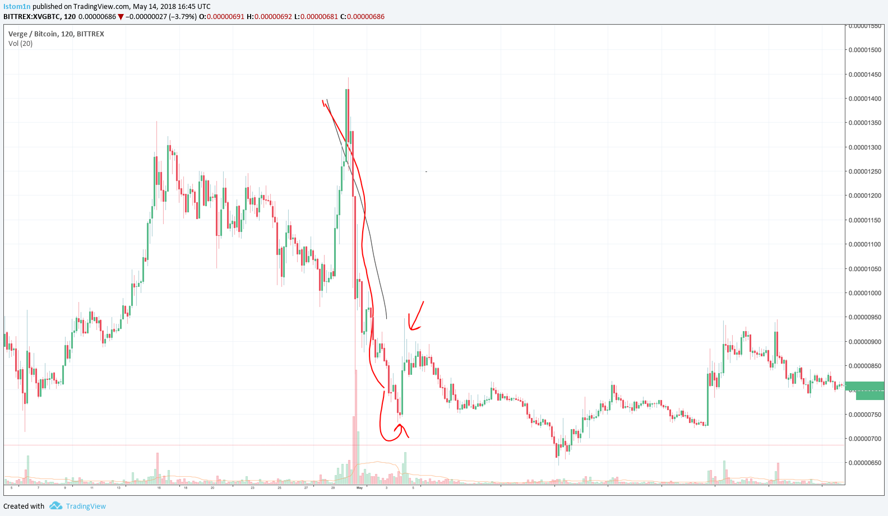

На прошлой неделе мы стартовали с нашей серий обучение Алгоритмическому трейдингу с урока [о временных промежутках](/posts/algorithmic-trading-101-lesson-1-time-series-analysis/). Теперь мы делаем еще один шаг вперед, вводя возврат к среднему в качестве модели при торговле одним активом. Когда мы пройдемся по основам, помните, что никогда не бывает одной истинной модели. Построение прибыльной стратегии требует хорошего управления данными, точной настройки параметров и оптимизации исполнения. Одна стратегия сегодня может оказаться нежизнеспособной уже завтра.

Не забывайте: мы всегда с вами, чтобы помочь! Если вы застряли или у вас есть своя собственная стратегия, которую вы хотели бы перенести в Ocean X, напишите нам в [Telegram](https://t.me/joinchat/HgDxLhDPfm73w8ttRYv1Gw) или напишите нам по адресу [hello@theoceanx.com](hello@theoceanx.com). Мы также будем вручать **пять призов в размере $1 000** в криптовалютном эквавиленте студентам или наставникам во время нашей серии, и еще не поздно зарегистрироваться! [Обсуждайте](https://t.me/joinchat/HgDxLhDPfm73w8ttRYv1Gw), показывайте, или помоте, и мы будем считать вас в наш маленький конкурс.

## Краткая информация о данных
Данные — это источник жизненной силы алгоритмической торговли — это то, как вы определяете начальные шаблоны, тестируете свои стратегии и убедитесь, что ваши модели реагируют в режиме реального времени. Но большое количнство данных это не всегда хорошо.
- Требуется время, чтобы структурировать и очистить данные в необходимую структуру данных, которая будет просто в использовании, например, изменение значений из целых чисел в плавающие с точкой или временное преобразования данных, например в минутах, секундах или миллисекундах.
- Тестирование больших довольно трудоемкий процесс, он может съедать пространство сервера и замедлить производительность вашей системы
- Огромное количество переменных в ваших моделях может привести к **мультиколлинеарности**, где оценки параметров становятся неустойчивыми и затрудняют назначение объясняющей силы. *[Прим. И: Иными словами, мультиколенниарность подразумевает факт приоритетноститех переменных,которые действиетельно имеют влияние на результат модели]*

Баланс достигается только при понимании того, сколько данных нужно исследоватьи сколькими данными, при этом, можно оперативно и эффективно управлять. По мере прохождения курса мы будем давать дополнительные рекомендации по управлению данными и их обработке. SQL и другие реляционные базы данных являются хорошими местами для начала: Silota предоставляет отличный [пример SQL-запроса](http://www.silota.com/docs/recipes/sql-bitcoin-ethereum-cryptocurrency-analysis.html) с данными криптовалюты, а [CoinAPI.io](https://www.coinapi.io/) позволяет собирать информацию с разных криптовалютных бирж. (И как только мы запустимся, мы покажем вам, как брать данные из Ocean X API.)

## Пересмотр создания стратегий
В прошлый раз мы наметили шаги, которые необходимо предпринять при построении стратегии алгоритмической торговли. Давайте обсудим это более подробно:

#### 1. Определить тип стратегии
Мы покажем вам несколько типов моделей, но есть бесконечные возможности для экспериментов в зависимости от вашей цели: Альфа-генерация, захват спреда *[Прим. И: Что-то вроде купли-продажи авто, когда тем, кому нудно совершить сделку прямосейчас, теряет % от рыночной стоимости]*, арбитраж, Маркетмейкер, управляемое событие и т. п. И нет такой стратегии, которая была бы лучше любой другой. Это действительно зависит от Вашего профиля риска / вознаграждения, и насколько хорошо вы реализуете и тестируете. Алгоритмические торговые веб-сайты и количественные финансовые документы могут быть хорошими источниками для поиска идей. Некоторые из наших фаворитов включают [Quantstart](https://www.quantstart.com/), [Quantopian](https://www.quantopian.com/), [QuantConnect](https://www.quantconnect.com/), [Wilmott](https://www.wilmott.com/), [arXiv](http://arxiv.org/archive/q-fin), и [SSRN](http://www.ssrn.com/).

#### 2. Генерировать сигналы для принятия решения
Также важно иметь сигналы входа и выхода. Если вы занимаете только одну позицию, это может быть довольно просто. С несколькими позициями важно убедиться, что ваши сигналы не перекрываются и/или не противоречат (т. е. ваша модель говорит вам входить и выходить из позиций на одном и том же активе одновременно). Сигналы входа, как правило, легче создавать — как только триггер *[Прим. И: Это такой механизм, который срабатывает при опредленном событии]* Вашей модели "попадает", вы торгуете. Сигналы выхода могут быть немного сложнее — вы можете взять небольшие быстрые победы, но вы также можете подумать о себе: "если я подожду немного дольше, может быть, я смогу получить больше очков". Таким образом, ваши решения по выходу (как определено общей прибылью или [стоп-лоссом](https://www.investopedia.com/terms/s/stop-lossorder.asp)) зависят от вашей терпимости к риску: чем дольше вы держите свою позицию, тем больше неопределенности вы сталкиваетесь.

#### 3. Тестировать на старых данных и оптимизация параметров модели
Тестирование на истории означает тестирование модели на исторических данных перед началом торговли. Можно моделировать результаты в контролируемой среде в течение различных периодов времени или сценариев, чтобы увидеть, как модель работает в различных условиях. И вы можете играть с "параметрами" (например, должен ли я использовать один или пять лагов *[Прим. И. промежутков времени]*?) чтобы найти набор, который дает последовательные, положительные результаты-оптимизированный для Вашего профиля риска / вознаграждения, конечно. Вам может потребоваться выполнить много, много, много итераций и конфигураций моделей, чтобы найти прибыльную стратегию. И небольшие изменения параметров могут иметь большое, а иногда и неожиданное влияние. Поэтому важно собирать данные, тестировать модели на их соответствие и постоянно обновлять / настраивать новые данные. Подробнее о тестировании на истории можно прочитать [здесь](https://www.quantstart.com/articles/Successful-Backtesting-of-Algorithmic-Trading-Strategies-Part-I).

#### 4. Учитывайть внешние факторы риска, такие как исполнение (ордера, например)
Ни одна модель не может предсказать будущее. Модель, по своей природе, является упрощенным представлением мира. На волатильном рынке криптовалют это особенно верно в отношении исполнения. Например, текущая цена актива составляет 1,00, и вы в длинной позиции, стоп-лосс ставим на продажу по 0.95. Предположим, что цены не обновляются непрерывно, а вместо этого через интервалы, и следующая цена, которую вы действительно видите и можете торговать, на самом деле равна 0,90. Ну, тогда вы продаете за потерю 0,10, хотя ваш предполагаемый "максимальный убыток" был 0,05! Эта проблема возникает из-за ликвидности и задержки в цене (это проблема, которая распространена на криптовалютных биржах, особенно DEXs (децентрализованных)).

Еще одним внешним фактором, который может приглушить прибыльность стратегии, являются транзакционные издержки (комиссия). Даже идеально протестированная модель может быть невыгодной, особенно если разработчик модели не учитывал транзакционные издержки (измеряемые не только сборами, но и проскальзыванием и другими факторами) должным образом. Если производительность вашей стратегии в реальном времени отличается от тестирования на истории, вам может потребоваться изучить некоторые из этих проблем. Некоторые из этих вопросов, связанных с криптовалютой, мы рассмотрим на последующих уроках.

#### 5. Оценка результатов тестирования
Наблюдение за величиной прибыли может ввести в заблуждение, потому что прибыль, естественно, выше, если вы инвестируете в более крупных позициях. Наиболее распространенным критерием, который используют люди, является [коэффициент Шарпа](https://ru.wikipedia.org/wiki/%D0%9A%D0%BE%D1%8D%D1%84%D1%84%D0%B8%D1%86%D0%B8%D0%B5%D0%BD%D1%82_%D0%A8%D0%B0%D1%80%D0%BF%D0%B0):

$$
\frac{r_p-r_f}{\sigma_p}
$$
где $r_p$ — доходность портфеля  
$r_f$ — безрисковая ставка (обычно ставка государственных облигаций)  
$\sigma_p$ — стандартное отклонение портфеля  

Коэффициенты Шарпа показывает эффективность вашей стратегии в более широкий контексте, какое количество риска или волатильности вы выбрали для выших возвратов (доходов). Большие коэффициенты Шарпа лучше означает либо более высокую прибыль, либо низкую волатильность, чтобы получить эти доход. Другие факторы, которые следует учитывать, включают просадки для хвостового риска (остаточного риста), среднюю прибыль на сделку и среднее время удержания позиции. *[Прим. И: простыми словами хвостовой риск — это риск (или вероятность) наступления редких событий]*

## Возвращение к среднему (Mean Reversion)
Модели средней реверсии (или возвращение к среднему) основаны на предположении, что если цена актива отклоняется от среднего значения, то она должна вернуться к среднему значению. Это может быть справедливым предположением для многих рынков — если цена падает слишком "низко", многие участники рынка могут рассматривать ее как дешевую. И поэтому, когда многие трейдеры идут покупать, это увеличивает цену-обратно к ее среднему уровню. Обратное также верно — если рассматривать как "дорогое", трейдеры будут продавать, чтобы захватить (возможно, временную) прибыль. Таким образом, возвращающиеся модели используют менталитет "покупайте низко, продавайте высоко", и это до моделиста, чтобы выяснить, какой может быть соответствующий "средний" уровень.

> *[Прим. И:] Пример пары XVG/BTC в начале апреля*

Что может привести к отклонению цены от средней? Новостные события часто вызывают наибольшие изменения. Там может быть выпуск нового продукта, заработок вызова, или иски, которые могли бы управлять ценой в любом направлении. Даже твиты или комментарии видных участников могут оказать сильное влияние на цену. Обратите внимание, что общее убеждение (по крайней мере, в контексте средней реверсии) заключается в том, что эти события или другие факторы, вызывающие отклонения цены, являются одноразовыми, и цена в конечном итоге вернется, но возможно, что может быть истинный прорыв-когда есть постоянное, а не временное изменение "среднего" уровня цены. Поэтому важно включить в модель параметр стоп — лосс — максимальную сумму, которую вы готовы потерять.

Давайте погрузимся в математическую модель. В дискретном времени возвратности мы можем моделировать движения цены как:

$$
X_{t+1}=X_t+K(\mu-X_t)+e_{t+1}
$$
где $X_t$ — текущее значение  
$X_{t+1}$ — значение следующего периода  
$\mu$ — математическое ожидание (среднее значение)  
$e_{t+1}$ — термин ошибки  

Таким образом, мы можем видеть, что наш прогноз цены является функцией насколько наша цена в момент времени $t$ отклоняется от среднего, умноженного на некоторую константу $K$. $K$ можно рассматривать как "скорость среднего возврата" — больший $K$ означает, что мы ожидаем, что цена вернется к своему среднему быстрее. Эта модель фактически является расширением авторегрессионной модели с одним лаговым периодом, поскольку мы не используем внешнего регрессора в уравнении.

**Техническое замечание:** в непрерывном времени, используя дифференциальное исчисление, другой распространенной формой модели среднего возврата является процесс Орнштейна-Уленбека.

$$
dX_t=K(\mu-X_t)d_t+\sigma dW_t
$$
где $dX_t$ — изменение цены  
$\mu$ — математическое ожидание (среднее значение)  
$K$ — наш коэффициент "скорости"  
$\sigma$ — стандартное отклонение  
$W_t$ — [Броуновское движение](https://ru.wikipedia.org/wiki/%D0%91%D1%80%D0%BE%D1%83%D0%BD%D0%BE%D0%B2%D1%81%D0%BA%D0%BE%D0%B5_%D0%B4%D0%B2%D0%B8%D0%B6%D0%B5%D0%BD%D0%B8%D0%B5#%D0%9F%D0%BE%D1%81%D1%82%D1%80%D0%BE%D0%B5%D0%BD%D0%B8%D0%B5_%D0%BA%D0%BB%D0%B0%D1%81%D1%81%D0%B8%D1%87%D0%B5%D1%81%D0%BA%D0%BE%D0%B9_%D1%82%D0%B5%D0%BE%D1%80%D0%B8%D0%B8)

Ддя более подробной информации, вы можете изучить статью [Орнштейна-Уленбека Процесс  как модель волатильности](http://stat.math.uregina.ca/~kozdron/Teaching/Regina/441Fall14/Notes/L31-32-Nov19.pdf).

## Собираем все воедино
Теперь давайте использовать те же примеры данных из прошлого урока, чтобы подробно изучить эту модель. На практике мы должны определить, насколько цена должна отклоняться от среднего, чтобы она была достаточно статистически значимой, чтобы занять позицию. Распространенными методами являются использование доверительных интервалов, индикаторов RSI, полос Боллинджера или даже фиксированных стандартных отклонений от скользящей средней.

| День               | Open  | Close |
| ------------------ | :---: | :---: |
| **День 6**         | 1.01  | 1.14  |
| **День 5**         | 1.16  | 1     |
| **День 4**         | 1     | 1.18  |
| **День 3**         | 0.986 | 1     |
| **День 2**         | 0.932 | 0.989 |
| **День 1**         | 0.987 | 0.915 |
| **Прошлые данные** | 0.911 | 0.987 |
| **Прошлые данные** | 0.922 | 0.911 |
| **Прошлые данные** | 0.834 | 0.921 |

Используя таблицу данных, мы видим, что значение $SMA$ цены закрытия $1.0059$, со стандартным отклонением 0.0893. Таким образом, один доверительный интервал $MA$ будет $(0.9166, 1.0952)$. Предполагая, что мы занимаем позиции только в том случае, если цена пробивает вне этого интервала, и если мы начинаем в день 1, наша первая позиция будет занята в день 4, так как $1.18$ находится за пределами полос. Мы бы заняли короткую позицию, полагая, что цена вернется к среднему значению $1.0059$. Как только цена возвращается на 5-й день, это прибыльная позиция.

В этом примере игнорируется параметр возвращегия к среднему, а также установка соответствующего стоп — лосса-оптимизация каждого из них может быть выполнена с помощью тестирования на истории, чтобы изучить, как максимизировать прибыль с минимальным риском. Например, вы можете установить свой стоп-лосс таким образом, что вы осуществуете позицию, если она выходит за пределы 3 стандартных отклонений — что может указывать на новый средний уровень цены. Или, может быть, это должно быть 2 стандартных отклонения — у вас может быть меньше прибыли, но меньше риска. Как и в случае со всеми алгоритмическими торговыми операциями, ваши собственные цели и толерантность к риску будут управлять многими вашими моделирующими решениями.

Вот еще немного информации о среднем возврате в контексте криптовалюты:
- [С точки зрения дневной торговли](https://cointelegraph.com/news/market-volatility-illiquidity-can-be-quite-profitable-for-bitcoin-traders)
- [Реализация на Python](https://enigma.co/catalyst/example-algos.html#mean-reversion)
- [Тестирование на исторических данных](https://flare9xblog.com/2017/11/30/momentum-mean-reversion-random-walk-cryptocurrency/)
- [Влияние комиссионных сборов](https://medium.com/@bart_46269/the-impact-of-trading-fees-on-low-to-medium-frequency-systematic-bitcoin-trading-strategies-bb90f6990c)

Отказ от обязательств: Как и всегда, мы не даем советов о наилучшей стратегии, и мы не несем ответственности за любые прибыли или убытки, которые вы можете понести при торговле в реальном времени, прото используйте эти методы.

## Задание №2
**- Условия:** Создайте свою собственную модель среднего возврата, используя The Ocean X API   
**- Бонус:** Тестирование на истории данных взятых с [CoinAPI.io](https://www.coinapi.io/)

> **Важная информация:** Мы даем людям выходные, чтобы завершить задание №1, если вы еще этого не сделали (и хотели бы)! Не забудьте отправить свои ответы на [hello@theoceanx.com](mailto:hello@theoceanx.com) если вы хотите, чтобы мы рассмотрели ваше решение.
Мы опубликуем наше готовое решение на следующей неделе. 

И помните, что  *любой*, кто участвует в [Telegram](https://t.me/joinchat/HgDxLhDPfm73w8ttRYv1Gw) или отправляет нам решение *в любое время* в ходе нашего курса Алгоритмической торговли, имеет право получить **один из наших пяти призов по $1 000 в криптовалюте**.

---

## Содержание
0. [Введение в Алгоритмический трейдинг | План обучения](/posts/algorithmic-trading-101-the-syllabus/)
1. [Алгоритмический трейдинг — Урок 1 | Анализ временных рядов](/posts/algorithmic-trading-101-lesson-1-time-series-analysis/)
2. ~~Алгоритмический трейдинг — Урок 2 | Данные, Разработка стратегий и возвращение к среднему~~

---

Возникли проблемы или просто хотите обсудить свою стратегию? Присоединяйтесь к нашему [Telegram](https://t.me/joinchat/HgDxLhDPfm73w8ttRYv1Gw) каналу, чтобы получить обратную связь в режиме реального времени.

Заодно можно подписаться на [Twitter автора перевода](https://twitter.com/istom1n).

---

<a target="_blank" href="https://medium.com/the-ocean-x/algorithmic-trading-101-lesson-2-data-strategy-design-and-mean-reversion-25c19a003328">Источник статьи</a>