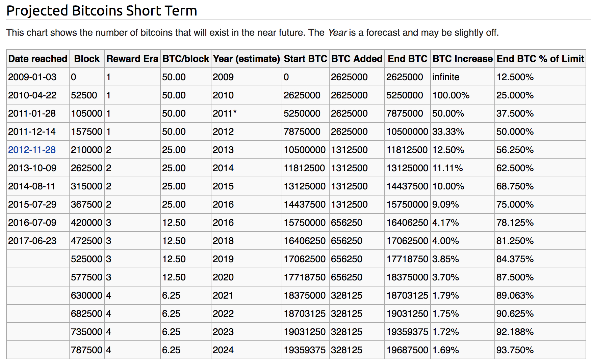
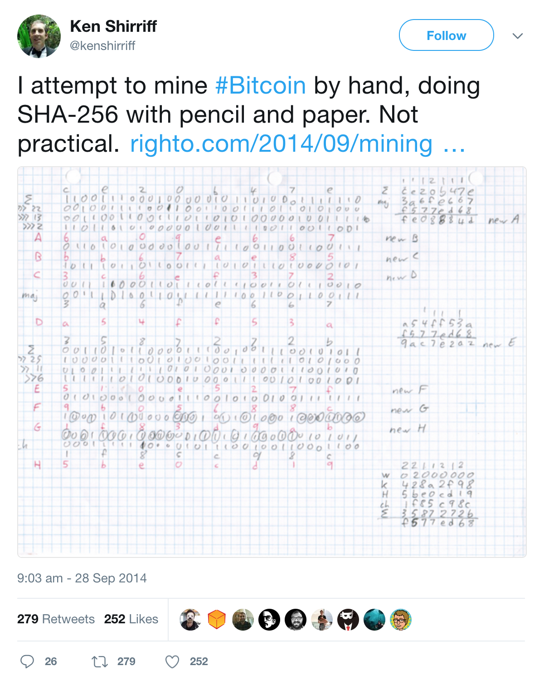

#### Почему печатный станок — это печалька

Одним из ключевых свойств протокола Биткойн, благодаря которым он вообще получил признание, является невозможность «включить печатный станок», как это делают центробанки всех стран, и допечатать «на олимпиаду», «на Крым» и так далее. Ибо при каждом включении печатного станка обесцениваются те деньги, которые находятся у вас, дорогие сограждане, в руке/под подушкой/в банке, то есть, происходит инфляция.

Поясним на коротком примере. Пусть на планете *Плюк* жило $4$ человека, и у каждого было по \$100. Соответственно, каждый из них мог купить $\frac{1}{4}$ всех богатств планеты *Плюк*, так как каждый из них является владельцем \$100, а суммарное количество долларов на планете было равно \$400. Теперь банкир взял и допечатал себе ещё \$400. У банкира стало \$500, а у остальных троих осталось по \$100. Таким образом, теперь банкир может купить $\frac{5}{8}$ богатств планеты, а остальные трое — только по $\frac{1}{8}$, в то время как до действий банкира они могли купить $\frac{1}{4}$. Заметим, что с тем же успехом он мог превратиться в бандита, напасть на каждого из этих 3-х и отнять у каждого по $\$50$ — тогда бы у банкира (теперь уже бандита) стало $\$250$, а у всех остальных осталось по \$50 (и снова то же соотношение — $\frac{5}{8}$ всех денежных запасов у бандита, по $\frac{1}{8}$ у остальных). Экономически между допечатыванием $\$400$ и физическим грабежом каждого из жителей на $\$50$ нет никакой разницы (в этой ситуации), вот что я хочу сказать.

#### Содержание ~~в студию~~

[TOC]

#### Биткойн — это избавление от [самого болезненного и самого незаметного налога](http://bitnovosti.files.wordpress.com/2014/02/durov-twit.png)
Так вот в сети Биткойн никто не может «прийти и допечатать сколько нужно» (хотя бы потому, что эта сеть является полностью децентрализованной и никем не контролируется). Выпуск биткойнов является строго плановым, гораздо более плановым даже, чем советская экономика, потому что алгоритм раз и навсегда прописан в протоколе Биткойн-сети (что-то, что является куском программного кода, всегда является более плановым, чем советская экономика). Раз в 2 недели т.н. сложность майнинга автоматически пересчитывается так, чтобы независимо от суммарной мощности участвующих устройств каждый новый блок кому-либо из майнеров этой замечательной планеты удавалось найти в среднем раз в 10 минут. (О том, что такое сложность майнинга, блок, и зачем его находить, будет сказано ещё очень много слов). Как результат, скорость выпуска биткойнов строго детерминирована (т.е. предопределена). Выплата за нахождение блока в первые 4 года составляла 50 BTC; в последующие 4 года (и поныне, т.к. блокчейн сети Биткойн был запущен 3 января 2009 года) [она «уполовинивается»](https://en.bitcoin.it/wiki/Controlled_supply#Projected_Bitcoins_Short_Term) и составляет 25 BTC; в последующие 4 года it also would halve (она также уполовинивается) и уже составляет 12.5 BTC, ну и так далее.

> На самом деле «4 года» здесь везде надо заменять на «$210\ 000$ блоков». Поскольку 1 блок удаётся найти в среднем раз в 10 минут, в час удаётся найти в среднем 6 блоков, в сутки — 144, в год — $52\ 560$, и, наконец, мат. ожидание количества найденных блоков за 4 года — $210\ 240$. Про 4 года говорят для удобства, потому что это более наглядно, чем верное значение в $210\ 000$ блоков, прописанное в протоколе. 

Выплаты за нахождение блока являются выплатами «из ниоткуда», и это и есть единственный способ эмиссии (появления новых монет). Достаточно справедливо — каждая такая выплата достаётся человеку, который потратил на майнинг вычислительные мощности своих устройств и оплатил немалые порой счета за электричество.

Посчитаем количество всех биткойнов, которые когда-либо будут выпущены. Ещё раз, в первые 4 года каждая награда составила 50 BTC, во вторые 4 года каждая награда составляет 25 BTC... Всего получается $210\ 000 ⋅ 50 + 210\ 000 ⋅ 25 + 210\ 000 ⋅ 12.5 + ... = 210\ 000 ⋅ (50 + 25 + 12.5 + …).$

В скобках получилась геометрическая прогрессия (привет, школа!). Сумма бесконечной геометрической прогрессии, [как мы помним](https://ru.wikipedia.org/wiki/%D0%93%D0%B5%D0%BE%D0%BC%D0%B5%D1%82%D1%80%D0%B8%D1%87%D0%B5%D1%81%D0%BA%D0%B0%D1%8F_%D0%BF%D1%80%D0%BE%D0%B3%D1%80%D0%B5%D1%81%D1%81%D0%B8%D1%8F#.D0.A1.D0.B2.D0.BE.D0.B9.D1.81.D1.82.D0.B2.D0.B0), равна: $\frac{b_0}{1-q}$, где $b_0$ — начальный элемент прогрессии (в нашем случае $50$), а $q$ — множитель её (в нашем случае $\frac{1}{2}$). Таким образом, полностью благодаря школьной математике, $50 + 25 + 12.5 + ... = 100$, и полная сумма всех биткойнов, которые когда-либо будут выпущены, равна $210\ 000 ⋅ 100 = 21\ 000\ 000 = 21$ million BTC.

Мы получили, что число биткойнов ограничено самим протоколом, и скорость их добычи тоже жёстко задана протоколом. Биткойнов никогда не будет больше, чем 21 миллион — за то и любим. При всём [сумасшедшем росте](https://blockchain.info/ru/charts/difficulty?timespan=all&showDataPoints=false&daysAverageString=1&show_header=true&scale=0&address=) сложности [добыча биткойнов происходит равномерно](https://blockchain.info/ru/charts/total-bitcoins?timespan=all&showDataPoints=false&daysAverageString=1&show_header=true&scale=0&address=) и в точности как задумал создатель; отметим, что за первые 6 лет работы протокола добыто [почти 14 миллионов биткойнов](http://coinmarketcap.com/). 

#### Мммм, что за «выплаты за нахождение блока»?

Этими выплатами стимулируется деятельность по формированию единой истории транзакций в децентрализованной системе. Полагаю, не нужно объяснять, почему «книга учёта» денежных переводов не должна иметь разных версий. Также понятно, что каждый из пользователей хотел бы видеть в качестве общепризнанной истории транзакций себе наиболее выгодную — например, такую, в которую «не вошли» потраченные им деньги $\Rightarrow$ в децентрализованной системе договориться о том, чья история транзакций «правильная», а чья «неправильная», сложно. Тем не менее, благодаря идее так называемого майнинга и деятельности майнеров, которые получают за каждый «найденный блок» вознаграждение в $25$ биткойнов, устойчивое к атакам децентрализованное соглашение успешно достигается. Ниже мы сейчас объясним, как работает сеть Биткойн, совершенно не комментируя, например, вопросы устойчивости получающегося децентрализованного соглашения. А в разделе [«Зачем нужен майнинг?»](https://github.com/snordenstorm/wiki/wiki/%D0%9C%D0%B0%D0%B9%D0%BD%D0%B8%D0%BD%D0%B3-%D0%B1%D0%B8%D1%82%D0%BA%D0%BE%D0%B9%D0%BD%D0%BE%D0%B2#%D0%97%D0%B0%D1%87%D0%B5%D0%BC-%D0%BD%D1%83%D0%B6%D0%B5%D0%BD-%D0%BC%D0%B0%D0%B9%D0%BD%D0%B8%D0%BD%D0%B3) мы последовательно распишем, зачем всё так, почему устойчивая к атакам конструкция с неизбежностью должна быть такой, почему она не может быть проще.

#### Как работает сеть Биткойн?

Когда вы открываете свой Биткойн-кошелёк, он автоматически подключается к нескольким другим участникам сети (peers, пиры), находящимся «онлайн». Когда вы декларируете желание переслать деньги (совершить транзакцию), ваш компьютер распространяет её пирам. Каждый из пиров, получив транзакцию, производит [примерно 20 проверок её валидности](https://en.bitcoin.it/wiki/Protocol_rules#.22tx.22_messages) (включая проверку цифровой подписи, подтверждающей владение пересылаемыми деньгами). Затем каждый из тех, кому транзакция показалась валидной, ретранслирует её; так транзакция распространяется по сети и в конечном итоге доходит до всех находящихся онлайн участников.

Так вот, есть такие участники, которые не просто ретранслируют последние транзакции, а собирают их в блоки и пытаются эти блоки «запаковывать». Называются такие участники майнерами (miners). А именно, после того как майнер получает транзакцию и проверяет её валидность, он добавляет её в пачку к другим таким новым транзакциям, берёт также таймштамп и другие подобные данные (пачка транзакций + эти данные = блок), после чего пытается перебором найти так называемый подходящий хэш (winning hash) для этого блока. По определению, подходящим хэшем называется такой результат двойного действия хэш-функции на заголовок блока `sha256(sha256(Block_Header))`, который удовлетворяет условию `sha256(sha256(Block_Header)) < target` (это условие ещё иногда называют условием валидности [proof-of-work](https://ru.wikipedia.org/wiki/Proof-of-work) блока). [SHA-256](http://ru.wikipedia.org/wiki/SHA-2) — одна из самых хорошо изученных [хэш-функций](https://github.com/ethereum/wiki/wiki/Glossary#cryptography), десятилетиями применявшаяся в банковской сфере; отличный от перебора способ, позволяющий находить подходящие хэши, неизвестен (что косвенно подтверждается средним временем нахождения подходящего хэша — оно в точности такое, как будто происходит перебор). Тому, из чего состоит заголовок блока, как протокол вычисляет значение target и другим техническим деталям посвящён [специальный раздел](https://github.com/snordenstorm/wiki/wiki/%D0%9C%D0%B0%D0%B9%D0%BD%D0%B8%D0%BD%D0%B3-%D0%B1%D0%B8%D1%82%D0%BA%D0%BE%D0%B9%D0%BD%D0%BE%D0%B2#%D0%A5%D0%BE%D1%80%D0%BE%D1%88%D0%BE-%D0%B0-%D1%87%D1%82%D0%BE-%D0%BF%D1%80%D0%BE%D0%B8%D1%81%D1%85%D0%BE%D0%B4%D0%B8%D1%82-%D0%BF%D1%80%D0%B8-%D0%BC%D0%B0%D0%B9%D0%BD%D0%B8%D0%BD%D0%B3%D0%B5-%D1%82%D0%B5%D1%85%D0%BD%D0%B8%D1%87%D0%B5%D1%81%D0%BA%D0%B8-%D0%92-%D1%87%D1%91%D0%BC-%D0%B7%D0%B0%D0%BA%D0%BB%D1%8E%D1%87%D0%B0%D0%B5%D1%82%D1%81%D1%8F-%D1%81%D0%B0%D0%BC-%D0%BF%D1%80%D0%BE%D1%86%D0%B5%D1%81%D1%81) этой статьи. Сейчас следует посмотреть на [текущее значение target](http://blockexplorer.com/q/hextarget) (представленное в 16-ричной форме), и понять, что доля чисел, меньших текущего значения target, по отношению ко всем числам такой длины <u>крайне</u> мала. А output действия хэш-функции выглядит как случайное число такой длины. (Как совсем случайное: любая хэш-функция обладает тем свойством, что малейшее изменение того, что подано на вход хэш-функции, приводит к абсолютно непохожему хэшу вследствие [лавинного эффекта](https://ru.wikipedia.org/wiki/%D0%9B%D0%B0%D0%B2%D0%B8%D0%BD%D0%BD%D1%8B%D0%B9_%D1%8D%D1%84%D1%84%D0%B5%D0%BA%D1%82).) Т.е. найти подходящий хэш (часто это называют «найти блок») крайне маловероятно, поэтому майнеры постоянно наращивают свои вычислительные мощности, чтобы скорость перебора хэшей, а вместе с ней и вероятность собственного успеха, увеличить. Майнеры не дублируют вычисления друг друга: каждый блок содержит «нулевую» транзакцию, которая выплачивает награду за нахождение блока из пустоты в любой из кошельков по желанию добывающего майнера (так называемая coinbase transaction или generation transaction: [пример](http://blockexplorer.com/b/331005)); очевидно, желание каждого заключается в том, чтобы эта награда выплачивалась в один из его кошельков, так что все майнеры добывают блоки с несовпадающим списком транзакций. Каждый из майнеров работает совершенно независимо от других: разные майнеры могут принимать разные решения о том, какие транзакции они хотят включать в добываемые ими блоки. Далее, когда кому-то наконец повезло и подходящий хэш найден, майнер, которому повезло, тут же стремится распространить его в сеть. Сеть проверяет валидность блока, в случае успешности проверки включает его в блокчейн и переходит к поиску следующего. Ключевым моментом является то, что проверки валидности происходят независимо: каждый узел сам выносит решение, добавлять блок в свою версию блокчейна или нет. Анонимность, распространённость по всему земному шару и отсутствие у узлов инструментов для согласования действий друг с другом приводят к тому, что каждый узел принимает объективное решение о валидности.

Если сеть включила блок в блокчейн, за счёт coinbase transaction состояние нашедшего этот блок майнера увеличивается на (на ноябрь 2014) 25 BTC. Напоминаем, что эти 25 BTC берутся из воздуха и что награда за нахождение блока является единственной формой эмиссии биткойнов. Как уже было сказано в предыдущем разделе, в первые четыре года существования сети награда за нахождение блока составила 50 BTC, во вторые четыре года она составляет 25 BTC, в третьи четыре года она составит 12.5 BTC, и так далее — словом, [она падает в два раза каждые четыре года](https://en.bitcoin.it/wiki/Controlled_supply). ([Genesis block](https://en.bitcoin.it/wiki/Genesis_block) был добыт 3 января 2009 года.) Те же, кто просто хранят историю транзакций на своих жёстких дисках, не получают никаких выплат; сам Сатоши отмечал, что это наиболее узкое место в архитектуре системы. Текущий курс BTC/USD можно посмотреть, например, [здесь](http://coinmarketcap.com/).

Также майнер забирает себе все комиссии всех транзакций, вошедших в добытый им блок, если авторы этих транзакций установили комиссии, отличные от нуля. Сумма всех комиссий в блоке [приносит майнерам сейчас](https://blockchain.info/ru/charts/transaction-fees) в среднем 0.1 BTC дополнительного дохода (что довольно немного по сравнению с наградой за блок).

В Биткойн есть те, кто формирует историю транзакций, есть те, кто её только хранит, и есть те, кто не делает ни того, ни того. Те, кто её формируют, называются майнерами (*от англ.* to mine — добывать, по аналогии с to mine gold — добывать золото), а сам процесс называется майнингом (mining). Те, кто лишь только хранит историю транзакций, называются полными нодами (full nodes). Каждый может в любой момент заняться майнингом или прекратить им заниматься; [стать полной нодой](https://bitcoin.org/ru/download) (=начать хранить историю всех транзакций) или перестать ей быть. Все узлы в Биткойн совершенно равноправны; по этой причине Биткойн также называют <u>одноранговой</u> сетью. Как торренты, да.

Подытожим. Люди, которые хотят перевести по какому-то адресу деньги, жмут на соответствующие кнопочки в своём биткойн-клиенте («биткойн-программе»). Биткойн-клиент в ответ на такую неслыханную дерзость отправляет в сеть транзакцию: заявление «я, адрес 1KeatDCtrEnzaR42B2eUduYXmcM4U9jphB, хочу переслать эти деньги по адресу 1FTgzPJCbpCWYfF6VxPdmCMPUDBfygut2h». Это заявление содержит цифровую подпись владельца; узлы проверяют подлинность цифровой подписи и, если всё корректно, ретранслируют транзакцию дальше, так что в течение короткого времени она добирается до всех пользователей сети. Пачка новых (=не вошедших в другие блоки) транзакций вкупе с ещё некоторыми данными (таймштамп, nonce и ещё парочка) образует блок; каждый из майнеров формирует блок, после чего пытается удовлетворить условию proof-of-work: перебором ищет такое nonce (более точно — подходящую комбинацию данных блока), чтобы условие `sha256(sha256(Block_Header)) < target` было выполнено. Когда кому-то везёт и у этого кого-то получается удовлетворить условию proof-of-work (это называется «найти блок»), такой майнер сразу транслирует найденный блок другим узлам сети; другие узлы проверяют валидность этого блока, и, если всё корректно, добавляют этот блок в свою версию цепочки блоков (=в блокчейн), ретранслируют новость о нахождении нового блока дальше; в конечном счёте все переходят к поиску следующего блока. Везёт кому-то из майнеров этой планеты в среднем раз в 10 минут — под это значение скорости добычи блоков каждый раз подстраивается так называемая сложность майнинга (об этом тоже будет сказано в [технической части](https://github.com/snordenstorm/wiki/wiki/%D0%9C%D0%B0%D0%B9%D0%BD%D0%B8%D0%BD%D0%B3-%D0%B1%D0%B8%D1%82%D0%BA%D0%BE%D0%B9%D0%BD%D0%BE%D0%B2#%D0%9A%D0%B0%D0%BA-%D0%BF%D0%B5%D1%80%D0%B5%D1%81%D1%87%D0%B8%D1%82%D1%8B%D0%B2%D0%B0%D0%B5%D1%82%D1%81%D1%8F-%D1%81%D0%BB%D0%BE%D0%B6%D0%BD%D0%BE%D1%81%D1%82%D1%8C)). Добытый блок содержит «нулевую» транзакцию, выплачивающую из пустоты добывшему его майнеру 25 биткойнов. Блокчейн хранит все когда-либо произошедшие биткойн-транзакции («если транзакция не находится в блокчейне, её не было»), хранится на компьютере любого энтузиаста (="держателя полной ноды»), каждая полная нода самостоятельно [проверяет валидность новых блоков](https://en.bitcoin.it/wiki/Protocol_rules#.22block.22_messages), т.е. самостоятельно выносит решение о том, включать или не включать новый блок в свою версию блокчейна. За счёт того, что полные ноды находятся по всему миру, анонимны и неизвестны друг другу, они не имеют возможности всем вместе договориться, и потому принимают справедливые решения о валидности/невалидности блоков или транзакций. Энтузиастов, хранящих копии блокчейна, сейчас примерно 6500, их компьютеры [разбросаны по всему миру](https://getaddr.bitnodes.io/). Каждый может стать таким энтузиастом.

#### Господи, какой кошмар. Зачем так сложно? Нельзя хранить историю транзакций, как обычно, на серверах?

Да, действительно, централизованная цифровая валюта может хранить всю историю транзакций на своих серверах, решая проблему без блокчейна, майнеров и доброго десятка других красивых новых слов. Однако функционировать централизованная цифровая валюта может лишь до тех пор, пока по адресу расположения используемых серверов не пришли дяди из ФБР или других компетентных органов. Ровно это произошло с валютой [Liberty Reserve](http://en.wikipedia.org/wiki/Liberty_Reserve). Любая централизация создаёт точку уязвимости и потому не годится.

Что касается традиционных электронных платёжных систем (WebMoney, Visa, Mastercard, Paypal) — в них транзакции проходят через централизованного посредника; операторам этих систем известна твоя личность, известны все твои финансовые операции, и, как результат, тебе приходится им доверять: верить в то, что они не будут использовать эту информацию в личных интересах, верить в то, что они не будут продавать её третьим лицам (например, маркетологам); верить в то, что они не заморозят твои средства под государственным давлением, давлением силовых структур. 

Эта парадигма ущербна, но до недавних пор альтернативы не существовало. Одно из главных преимуществ криптовалют — отсутствие необходимости кому-либо доверять, которое следует из [псевдоанонимности](https://en.bitcoin.it/wiki/Anonymity), децентрализованности и абсолютной прозрачности всей системы.

#### Кто может заниматься майнингом?

Кто угодно, если у него есть возможность тратить на это вычислительные ресурсы контролируемых им устройств.

#### Выгодно ли в 2014 году заниматься майнингом?

Скорее нет, чем да. Есть ощущение, что здесь как с калифорнийской [золотой лихорадкой](https://ru.wikipedia.org/wiki/%D0%97%D0%BE%D0%BB%D0%BE%D1%82%D0%B0%D1%8F_%D0%BB%D0%B8%D1%85%D0%BE%D1%80%D0%B0%D0%B4%D0%BA%D0%B0) 19 века — сейчас, в 2014, наибольший профит имеют уже производители оборудования для добычи. [В этом подразделе](https://github.com/snordenstorm/wiki/wiki/%D0%9C%D0%B0%D0%B9%D0%BD%D0%B8%D0%BD%D0%B3-%D0%B1%D0%B8%D1%82%D0%BA%D0%BE%D0%B9%D0%BD%D0%BE%D0%B2#%D0%9C%D0%BE%D0%B6%D0%BD%D0%BE-%D0%BB%D0%B8-%D0%B7%D0%B0%D1%80%D0%B0%D0%B1%D0%BE%D1%82%D0%B0%D1%82%D1%8C-%D0%BC%D0%B0%D0%B9%D0%BD%D0%B8%D0%BD%D0%B3%D0%BE%D0%BC) данной статьи мы пытаемся исследовать это подробно.

#### Зачем нужен майнинг?

У читателя может возникнуть ложное представление о том, что майнинг нужен для раздачи монет — знакомство с майнингом обычно начинается именно в этом контексте. Да, действительно, майнинг является единственной формой эмиссии (выпуска) монет, но всё же это глубоко вторично. Первично то, что без деятельности майнеров невозможно достижение децентрализованного соглашения о том, какие денежные переводы были и каких не было; биткойны имеют ценность только благодаря надёжной платёжной сети, которая поддерживается майнерами. Майнинг обеспечивает инфраструктуру и безопасность биткойн-транзакций. 

Биткойн является [первой](http://mapofcoins.com/) децентрализованной цифровой валютой. Не первой цифровой валютой вообще, но первой децентрализованной цифровой валютой. Концепции децентрализованных валют [предлагались и ранее](https://github.com/snordenstorm/wiki/wiki/%5BRussian%5D-White-Paper#История), но всякий раз до Биткойн эти концепции не решали все связанные с децентрализацией трудности. В чём заключаются эти трудности, каким образом воспеваемый нами технологический прорыв был совершён, где терпели неудачу те, кто пытались совершить его раньше?

#### Почему сделать децентрализованную валюту трудно

Используя хорошо известные в криптографии понятия [публичного и приватного ключа](https://www.pgpru.com/biblioteka/osnovy/vvedenievkripto/glava1/kriptosotkrytymkljuchom), можно доказывать с помощью цифровых подписей владение тем или иным активом, а также своё желание передать его кому-то другому (владельцу другого публичного ключа). Ключевая проблема здесь — проблема двойной траты одних и тех же монет: не существует криптографического способа узнать, не были ли передаваемые активы переданы перед этим кому-нибудь ещё.

В условиях, когда каждый как бы сам себе банк, всё же должна быть некоторая публичная книга учёта — без неё это будут не деньги, а произвольные числа на балансе каждого из желающих. Для децентрализованности такая книга учёта должна храниться распределённо. Распределённо — это такая, которую мог бы загрузить на свой жёсткий диск каждый энтузиаст; также она должна быть постоянно синхронизирующейся. Казалось бы, такое решение лежит на поверхности; в чём же здесь прорыв? Дело в том, что это не решение — точнее, это «решение» приводит к ещё большему количеству вопросов. Именно, как сделать так, чтобы история транзакций у всех пользователей была одинаковая? При том, что у каждого есть экономический стимул сделать так, чтобы его исходящие транзакции не попали в конечном счёте в «книгу учёта» после получения им товара. Это проблема, и без её решения Биткойн никому не был бы интересен, так как представлял бы собой конкурирующие друг с другом «книги учёта», выгодные тем или иным участникам.

Сразу на ум приходит решение вида «дать возможность голосовать за правильную книгу учёта», однако оно тоже оказывается неподходящим — купить ботнет или симулировать любое необходимое количество IP-адресов не так сложно. Кроме того, даже если каким-то образом удастся гарантировать принцип «1 человек — 1 голос», это не решает проблему экономических стимулов: для каждого пользователя экономическим стимулом всё равно останется голосовать за ту версию истории транзакций, которая ему наиболее выгодна.

Концепция майнинга как раз решает проблему экономического стимулирования пользователей поддерживать правильную и единую историю транзакций. Именно это глубоко нетривиально.

#### Как единственность истории транзакций могла бы нарушаться?

Из сказанного в минувшем подразделе ясно, что только хранящими «книгу учёта» узлами обойтись не получится. Поэтому в Биткойн помимо хранителей истории транзакций есть те, кто её формирует. При этом сеть умудрилась остаться одноранговой: каждый может в любой момент стать «формирующим» или перестать им быть, стать «хранителем» или перестать им быть. 

На первый взгляд кажется, что в силу децентрализованности те, кто хранят историю транзакций, могут:
* вносить в неё изменения: выкидывать неугодные транзакции из «книги учёта», подменять свои транзакции в «книге учёта», дописывать свои транзакции задним числом

А у тех, кто формирует историю транзакций, на первый взгляд, есть такие возможности:
* добавлять в «книгу учёта» транзакции, тратящие средства, которыми отправитель транзакции не владеет
* не включать в «книгу учёта» некоторые транзакции (например, транзакции, связанные с конкретным ненавистным пользователем, или вообще все транзакции)

Последовательно обсудим, почему каждая из этих ситуаций в Биткойн невозможна или крайне маловероятна.

#### Почему пользователь не может видоизменять «книгу учёта» как вздумается: выкидывать неугодные транзакции, подменять транзакции, дописывать желанные?

«Книга учёта» сети Биткойн называется словом *блокчейн* (*blockchain* = цепочка блоков). Название намекает нам, что книга эта состоит из блоков, которые образуют цепочку. Как будет сказано далее в [технической части](https://github.com/snordenstorm/wiki/wiki/%D0%9C%D0%B0%D0%B9%D0%BD%D0%B8%D0%BD%D0%B3-%D0%B1%D0%B8%D1%82%D0%BA%D0%BE%D0%B9%D0%BD%D0%BE%D0%B2#%D0%A5%D0%BE%D1%80%D0%BE%D1%88%D0%BE-%D0%B0-%D1%87%D1%82%D0%BE-%D0%BF%D1%80%D0%BE%D0%B8%D1%81%D1%85%D0%BE%D0%B4%D0%B8%D1%82-%D0%BF%D1%80%D0%B8-%D0%BC%D0%B0%D0%B9%D0%BD%D0%B8%D0%BD%D0%B3%D0%B5-%D1%82%D0%B5%D1%85%D0%BD%D0%B8%D1%87%D0%B5%D1%81%D0%BA%D0%B8-%D0%92-%D1%87%D1%91%D0%BC-%D0%B7%D0%B0%D0%BA%D0%BB%D1%8E%D1%87%D0%B0%D0%B5%D1%82%D1%81%D1%8F-%D1%81%D0%B0%D0%BC-%D0%BF%D1%80%D0%BE%D1%86%D0%B5%D1%81%D1%81), в заголовке каждого из блоков содержится хэш предыдущего блока, т.е. указание на предыдущий блок; таким образом, блоки образуют [связный список](http://ru.wikipedia.org/wiki/%D0%A1%D0%B2%D1%8F%D0%B7%D0%BD%D1%8B%D0%B9_%D1%81%D0%BF%D0%B8%D1%81%D0%BE%D0%BA). Блоки и хранят в себе все когда-либо произошедшие биткойн-транзакции (здесь уместно напомнить, что новый блок попадает в блокчейн в среднем раз в 10 минут). Согласно протоколу Биткойн, самая длинная цепочка является истинной историей транзакций (если точно, не самая длинная цепочка блокчейна, а цепочка с наибольшей суммарной сложностью, но на практике это почти одно и то же). Т.е. «лучше» та версия блокчейна, на которую было потрачено больше всего вычислительных ресурсов. Ветви блокчейна, отличные от самой длинной, игнорируются Биткойн-клиентом и не используются совершенно ни для чего. 

У себя на локальном компьютере каждый может внести какие угодно изменения в блокчейн, но при попытке взаимодействия с остальными участниками изменённую версию просто никто не примет. Почему? Потому что если хотя бы чуть-чуть изменить информацию в каком-либо из блоков (например, чуть изменить транзакцию) и не проделать никакой дополнительной работы, блок, в который внесены изменения, перестанет быть валидным, и все последующие — тоже. Таким образом, валидная часть вашего блокчейна будет меньше валидной части блокчейна честных его хранителей => такой изменённый блокчейн не будет цепочкой с наибольшей суммарной сложностью. 

Попробуем объяснить сказанное в предыдущем абзаце. За счёт того, что блоки в блокчейне хранятся в виде [деревьев Мёркла](https://github.com/snordenstorm/wiki/wiki/%5BRussian%5D-White-Paper#%D0%94%D0%B5%D1%80%D0%B5%D0%B2%D1%8C%D1%8F-%D0%9C%D1%91%D1%80%D0%BA%D0%BB%D0%B0), малейшее изменение хотя бы одной транзакции приводит к изменению корневого хэша дерева Мёркла => к изменению заголовка блока => [proof-of-work](https://en.bitcoin.it/wiki/Proof_of_work) его перестаёт быть валиден (условие `sha256(sha256(Block_Header)) < target` практически наверняка не будет выполнено). Поэтому сеть не воспримет «тупо» изменённый блок как валидный, и поэтому просто так вносить изменения в блокчейн нельзя (можно, конечно, но он перестанет быть истинной историей транзакций, т.к. его валидная часть окажется меньше валидной части честного блокчейна). 

Но зато в этот момент можно стать тем, кто формирует историю транзакций — *майнером* — и попытаться переделать proof-of-work: подобрать такие данные для изменённого блока, что proof-of-work будет валидно (условие `sha256(sha256(Block_Header_new)) < target` будет выполнено; `Block_Header_new` — заголовок изменённого блока). Предположим, после какого-то количества вычислительной работы это удалось сделать, и у нашего злоумышленника есть новая сияющая версия того же блока — версия с подменённой транзакцией. С валидным proof-of-work. Прекрасно. «Цепочка» злоумышленника, тем не менее, на этом этапе не будет самой длинной (здесь ещё раз подчеркнём, что истинной историей транзакций в Биткойн считается та, что изложена в самой длинной версии блокчейна). Злоумышленник   не может просто вставить вместо честной версии блока свою изменённую: в поле «хэш предыдущего блока» следующий блок хранит хэш неизменённого блока, т.е. ссылается на неизменённый. У такого злоумышленника есть всего один путь: добыть свою версию следующего блока, версию, ссылающуюся на изменённый блок; добывать ещё и ещё блоки, удлинняя свою цепочку, пока она не обгонит блокчейн честных майнеров. При этом надо понимать, что честные майнеры тоже не стоят на месте и продолжают добывать блоки в «честной» версии блокчейна. Как только блокчейн с подменённой транзакцией становится самым длинным, злоумышленник отправляет его в сеть, и сеть принимает его за истинную историю транзакций.

Проблема в том, что «обогнать» честный блокчейн практически нереально. С вероятностью 100% перегнать честных майнеров можно лишь если вычислительная мощность злоумышленника составляет более 50% вычислительной мощности всей сети; с падением доли вычислительной мощности вероятность успеха атаки падает экспоненциально. Атака обгоном честного блокчейна называется «атакой 51%» и детально разобрана в последнем разделе данной статьи. Стоимость закупки оборудования, необходимого, чтобы владеть 51% вычислительной мощности сети, вычислена [там же](https://github.com/snordenstorm/wiki/wiki/%D0%9C%D0%B0%D0%B9%D0%BD%D0%B8%D0%BD%D0%B3-%D0%B1%D0%B8%D1%82%D0%BA%D0%BE%D0%B9%D0%BD%D0%BE%D0%B2#%D0%A1%D1%82%D0%BE%D0%B8%D0%BC%D0%BE%D1%81%D1%82%D1%8C-%D0%BF%D0%BE%D0%BA%D1%83%D0%BF%D0%BA%D0%B8-%D0%BE%D0%B1%D0%BE%D1%80%D1%83%D0%B4%D0%BE%D0%B2%D0%B0%D0%BD%D0%B8%D1%8F-%D1%81%D0%BE%D1%81%D1%82%D0%B0%D0%B2%D0%BB%D1%8F%D1%8E%D1%89%D0%B5%D0%B3%D0%BE-51-%D0%BE%D1%82-%D0%BC%D0%BE%D1%89%D0%BD%D0%BE%D1%81%D1%82%D0%B8-%D1%81%D0%B5%D1%82%D0%B8) — грубая оценка даёт значение в 150 миллионов долларов. Таким образом, сеть Биткойн выглядит достаточно устойчивой к этому виду атак двойной траты.

Поэтому выгодно быть честным: с точки зрения каждого конкретного майнера, экономически рациональное поведение — заниматься майнингом на той же ветви блокчейна, что и все, потому что только так он заработает не 0 BTC. В некотором смысле майнеры «голосуют ногами": голосуют тем, на какую ветвь тратить свои вычислительные мощности.

Мы увидели, что любое изменение блокчейна приводит к невалидности блока, в который было внесено изменение, а также всех последующих. Единственный способ «выкинуть» или подменить какие-то транзакции, получается — сделать так, чтобы блок с нежелательной транзакцией целиком исчез из блокчейна вместе со всеми последующими (просто вырезать или изменить его нельзя: тогда получится, что следующий блок ссылается на несуществующий). Как блок может исчезнуть из блокчейна? Поскольку сеть считает истинной историей транзакций самую длинную цепочку блокчейна — только если образуется параллельная растущая ветвь, не содержащая тот блок, которая обгонит ветвь с тем блоком.  Чтобы сделать такую параллельную растущую ветвь, придётся стать тем, кто формирует историю транзакций, т.е. майнером: добыть свою версию выкинутых блоков с внесёнными изменениями, добывать блоки в своей цепочке и дальше и обогнать в какой-то момент блокчейн честных майнеров. Это возможно только если злоумышленник обладает вычислительной мощностью большей, чем все честные майнеры вместе взятые.

Биткойн — прекрасный пример структуры, в которой быть честным экономически выгодно. И это при том, что участники в большой степени анонимны и что за действия «против правил» сети им совершенно точно не грозят какие-либо проблемы с законом. «Правила» выстроены так, что против них идти можно, но невыгодно. Здесь я хотел бы выразить надежду, что в ближайшие десятилетия нас ждёт целый бум прозрачных структур во всех сферах человеческой деятельности, обладающих тем же свойством: желание быть честным поддерживается не страхом наказания со стороны центрального регулятора (что порождает лишь ненависть и коррупцию), а самым естественным способом, который только возможен — явной экономической выгодой. 

Что будет сделано следующим после освобождения денег — освобождение образования, освобождение системы выборов? 

#### Почему не получится включить в «книгу учёта» транзакцию, тратящую средства, которыми отправитель транзакции не владеет — например, отправить транзакцию от имени Сатоши/Дурова?

(Ответ на этот вопрос как раз был понятен задолго до появления идеи блокчейна и протокола Биткойн, так что тут никакой инновации.)

Для создания валидной цифровой подписи какой-то транзакции необходимо знать приватный ключ, соответствующий адресу, средства которого расходуются. Алгоритм [ECDSA](https://ru.wikipedia.org/wiki/ECDSA) (алгоритм цифровой подписи эллиптической кривой) (две юзер-френдли ссылки: [первая](http://bitnovosti.com/2014/10/23/bitcoin-math/), [вторая](http://bitnovosti.com/2014/11/06/bitcoin-math-2/)) берёт хэш отправляемого в сеть сообщения (с транзакцией), и с помощью арифметики на эллиптических кривых по сообщению, приватному ключу отправителя средств и случайному числу генерирует новую точку на кривой, координаты которой и являются цифровой подписью. Каждый, у кого есть публичный ключ, сообщение и цифровая подпись, может проверить валидность подписи. Таким образом, только лицо, обладающее приватным ключом, может создать цифровую подпись, а любое другое лицо может проверить её валидность с помощью соответствующего публичного ключа.

Поскольку каждый из узлов принимает решение самостоятельно, честные узлы никогда не примут [некорректную транзакцию](https://en.bitcoin.it/wiki/Protocol_rules#.22tx.22_messages) или [блок](https://en.bitcoin.it/wiki/Protocol_rules#.22block.22_messages), её содержащий. Анонимность, общедоступность и несогласованность действий узлов друг с другом являются гарантией честного поведения подавляющего большинства пользователей.

#### Почему майнеры не могут не включать в «книгу учёта» некоторые из транзакций?

Каждый конкретный майнер полностью свободен в выборе того, какие транзакции включать в добываемый им блок блокчейна, а какие — нет. Так что, вообще говоря, некоторая избирательность может существовать (если такого майнера не слишком беспокоит тот факт, что он недополучит комиссий с отвергнутых транзакций). Но за счёт децентрализованности, относительной анонимности и несогласованности действий майнеров друг с другом какой-либо другой майнер, когда ему повезёт, скорее всего, не откажется включить в свой блок связанную с ненавистным кому-то адресом транзакцию.

Чисто теоретически, если 100% майнеров договорятся не обслуживать транзакции, связанные с конкретным адресом (например, с адресом 1Gw1SaXq8K9Aunc6QvGNvE48CNX6Xca1qv), это будет блокада. Или, например, 100% майнеров могут договориться не включать в блокчейн только входящие по отношению к этому адресу транзакции, или только исходящие. Но на практике 
* скоординироваться будет трудно или невозможно (в том числе в силу мультиязычности, мультикультурности, интернациональности сообщества)
* трудно будет объяснить 100%-ам сообщества причину репрессии, т.к. из-за псевдоанонимности адресов Биткойн не всегда возможно установить личность человека, стоящего за конкретным адресом
* вообще, не бывает вопросов, по которым у 100% совпадало бы мнение
* обозлённый экономической блокадой пользователь может сам стать майнером, и уж он-то точно не будет блокировать свои транзакции и постарается вывести средства с блокируемого адреса как можно скорей
* найдётся какой-нибудь тролль, который забавы ради включит цензурируемую другими майнерами транзакцию в один из своих блоков. Если майнеры, которым крайне принципиально этого не допустить, в сумме контролируют 50% вычислительной мощности или более, они могут сделать хардфорк блокчейна: добыть альтернативную версию того блока, но без ненавистной транзакции, и продолжить майнинг на своей цепочке блокчейна. Если они контролируют более 50% вычислительной мощности, они придут к успеху: их версия (цепочка) блокчейна будет самой длинной, т.е. истинной. Об этом ещё будет сказано [в разделе про атаку 51%](https://github.com/snordenstorm/wiki/wiki/%D0%9C%D0%B0%D0%B9%D0%BD%D0%B8%D0%BD%D0%B3-%D0%B1%D0%B8%D1%82%D0%BA%D0%BE%D0%B9%D0%BD%D0%BE%D0%B2#%D0%9A%D0%B0%D0%BA-%D0%BC%D0%BE%D0%B6%D0%BD%D0%BE-%D0%B0%D1%82%D0%B0%D0%BA%D0%BE%D0%B2%D0%B0%D1%82%D1%8C-%D1%81%D0%B5%D1%82%D1%8C).

#### Что будет, если два майнера отправят в сеть новый блок одновременно?

Ещё раз подчеркнём, что каждый из блоков ссылается на предыдущий (содержит хэш предыдущего) => блоки упорядочены и образуют цепь (блокчейн). Эта цепь может расщепляться и без злоумышленников — это произойдёт тогда, когда два майнера почти одновременно транслируют в сеть сообщение о том, что они нашли валидный подходящий хэш (и хэши будут разными) для блока номер такого-то:

Тогда возникнет «вилка», временное раздвоение цепи: часть майнеров, к которой найденный первым майнером блок распространился раньше, отбросит блок второго и начнёт поиск следующего блока на цепи первого — and, vice versa, часть майнеров, к которой найденный вторым майнером блок распространился раньше, отбросит блок первого и начнёт поиск следующего блока на цепи второго: 

Однако очень быстро станет понятно, какая из цепей победит. На практике следующий блок является решающим. Поскольку за добычу блоков на не самой длинной цепи никаких выплат нет, все с неё (кто раньше, кто позже, а на практике — сразу же, вложения в оборудование надо отбивать) убегут:

Тот блок, которому не повезло, останется брошенным (равно как и его потомки) — а тот, которому повезло, станет частью блокчейна. (Брошенные блоки случаются довольно часто, [примерно раз в день](https://blockchain.info/orphaned-blocks), и ждать 6 подтверждений продавцам рекомендуется в том числе и поэтому.) Таким образом, расщепление возможно, но довольно быстро разрешается само собой. [Вот всё то же самое, но более подробно.](http://chimera.labs.oreilly.com/books/1234000001802/ch08.html#forks)

#### А майнинг обязательно должен быть каким-то таким?

Бывают валюты без майнинга в том понимании, в котором о нём рассказывается в этой статье. Здесь рассказывается про то, как устроен майнинг в случае первой и пока что главной валюты — Биткойн (PoW-майнинг, PoW = proof of work). Бывает также [PoS-майнинг](http://habrahabr.ru/post/207120/) (proof of stake) [(критика PoS-майнинга)](https://blog.ethereum.org/2014/07/05/stake/), бывают гибридные (PoW/PoS, обычно с коротким временем PoW) валюты. Есть и другие идеи: proof-of-excellence (она же proof-of-play) (Motocoin), [proof-of-burn](http://bitcoin.stackexchange.com/questions/24187/what-is-proof-of-burn) (Counterparty), ...

Майнинг может быть каким угодно, если он создаёт экономический стимул поддерживать единую историю транзакций и защищает от всех возможных атак. Вы можете придумать свой способ майнинга. 

#### Я [посмотрел на хэшрэйт](https://blockchain.info/ru/charts/hash-rate) и увидел — человечество вычисляет примерно $10^{17}$ хэшей в секунду с целью подобрать подходящее значение nonce. Какова польза человечеству от этих вычислений?

Реальная полезность любого вида майнинга — это обеспечение надежного клиринга и невозможности подделок и «откатов транзакций». В нецифровых валютах эта задача решается (и то не полностью) комплексом дорогостоящих мероприятий по «защите от подделок», постоянной проверкой подлинности банкнот и многоуровневым ограничениям доступа к банковской системе. Даже сама по себе «банковская безопасность» — это многомиллиардная индустрия, где кормится куча компаний. То, что Биткойн позволяет перестать зря транжирить все эти огромные ресурсы, просто заменив их вычислительной мощностью — это огромная экономия и польза для всего человечества.

Но на самом деле вопрос хороший. Если бы удалось придумать такое полезное (например, для науки) вычисление, которое само по себе является вычислительно сложным, а проверка корректности которого (проверка того, что вычисляющий «не срезает углы») производится значительно быстрее самого вычисления (как проверка выполненности условия proof-of-work в Биткойн), можно было бы отказаться от текущего вида майнинга в пользу такого, и мы бы приблизили будущее лет на десять просто сразу. Пока что, впрочем, такое вычисление придумать никто не смог. 

#### Хорошо, а что происходит при майнинге технически? В чём заключается сам процесс?

##### Что есть майнинг: в нулевом приближении

Майнинг это ______________, и если кому-то удастся ____________, то он молодец и получает 25 BTC.

##### Что есть майнинг: на самом деле

Процесс майнинга заключается в том, что майнер перебором ищет такое `nonce` (nonce — не имеющее никакого глубокого смысла число, сокращение от «number used once»), что [хэш-функция](https://github.com/snordenstorm/wiki/wiki/%5BRussian%5D-Glossary#%D0%9A%D1%80%D0%B8%D0%BF%D1%82%D0%BE%D0%B3%D1%80%D0%B0%D1%84%D0%B8%D1%8F) `sha256(sha256(Block_Header))` даёт число, меньшее так называемого [target](https://en.bitcoin.it/wiki/Target) — некоторого крайне малого динамически изменяющегося 256-битного числа. Условие `sha256(sha256(Block_Header)) < target` также называют условием валидности [proof-of-work](https://ru.wikipedia.org/wiki/Proof-of-work) блока; иногда оно звучит как «подходящий хэш должен начинаться с некоторого числа нулей». Что такое хэш-функция sha256(), [знает википедия](https://ru.wikipedia.org/wiki/SHA-2), а ещё об этом идеально написано [здесь](https://dl.dropboxusercontent.com/u/14533127/paperfor/sha256.pdf). Что такое этот самый Block_Header? По-русски это называется «заголовок блока» :), и состоит он из 80 байт, а именно, 

|   Что это | Когда изменяется | Размер в байтах |
|------------ | ------------- | ------------- | -------------|
|Версия | Текущая версия протокола | В случае изменения протокола |
|Хэш предыдущего блока | 256-битный хэш предыдущего заголовка блока | При переходе к поиску следующего блока |
|Корневой хэш дерева Мёркла | 256-битный хэш, основанный на всех транзакциях, включаемых в искомый блок | Когда майнер добавляет транзакцию в искомый блок |
|Таймштамп | Текущее [Unix-time](https://ru.wikipedia.org/wiki/UNIX-%D0%B2%D1%80%D0%B5%D0%BC%D1%8F) в секундах | Каждые несколько секунд |
|Bits | Текущее значение target в компактном формате | После каждого изменения [сложности](https://en.bitcoin.it/wiki/Difficulty) |
|Nonce | 32-битное число (начинающееся с 0) | После каждой неудачной попытки происходит nonce++ |

Заголовок блока является результатом [конкатенации](http://ru.wikipedia.org/wiki/%D0%9A%D0%BE%D0%BD%D0%BA%D0%B0%D1%82%D0%B5%D0%BD%D0%B0%D1%86%D0%B8%D1%8F) этих шести параметров. (Более точно, два из них при этом записываются в обратном порядке: `concatenate (версия; хэш предыдущего блока, записанный в обратном порядке; корневой хэш дерева Мёркла, записанный в обратном порядке; таймштамп; bits; nonce)`. Ещё одно несущественное уточнение: не `sha256(sha256(Block_Header))` должно быть меньше target, а записанное в обратном порядке `sha256(sha256(Block_Header))`.) Чуть более подробно обо всём этом [здесь](https://en.bitcoin.it/wiki/Block_hashing_algorithm).

Соответственно, если кому-то повезло, то он транслирует найденный блок в сеть, как бы говоря сети: «смотрите! у меня получилось!». Другие узлы независимо друг от друга вычисляют один этот хэш и говорят: «да, чувак, двукратный sha256-хэш от вычисляемого по данным твоего блока заголовка блока действительно меньше target'а», добавляют блок в блокчейн, и все майнеры отправляются на поиски следующего. (Или не добавляют, [если им что-то не нравится](https://en.bitcoin.it/wiki/Protocol_rules#.22block.22_messages) — каждый сам принимает решение, а несвязанность узлов друг с другом является залогом его объективности.) Если блок добавлен в блокчейн, нашедший его майнер радуется: ведь в нём есть так называемая coinbase transaction, которая из ниоткуда выплачивает ему награду за нахождение блока, которая сейчас составляет 25 BTC (а также ему достаются комиссии всех транзакций в найденном им блоке). Таким образом, борьба идёт за то, чтобы найти такую комбинацию значений nonce, timestamp и других данных блока, которая бы удовлетворяла условию `sha256(sha256(Block_Header)) < target` («найти блок»). Это крайне маловероятно: вот [текущая вероятность](https://blockchain.info/q/probability) того, что следующий хэш, который вы вычислите, будет удовлетворять этому условию. 

На данный момент неизвестен способ находить такие данные блока как-либо ещё, кроме как перебором. SHA256-хэширование используется в банковской сфере в течение десятилетий и способ восстановления прообраза по хэшу до сих пор не был обнаружен. Что также приятно, потенциальный взлом SHA256-хеширования не оставляет возможностей для скрытной манипуляции: сообщество заметит, что `nonce` генерируются очень легко и быстро, в результате чего просто перейдёт на другой алгоритм хеширования. Хэшрэйт [наиболее мощных специализированных](https://en.bitcoin.it/wiki/Mining_hardware_comparison) устройств сейчас составляет 6 Thash/s; умножив приведённую выше вероятность на 6 ⋅ 10^12, можно получить вероятность того, что с помощью одного самого современного такого устройства вам удастся за следующую секунду найти блок. Всё равно мало, так что майнинг в 2014 году, по факту, происходит на фермах, состоящих из специализированных устройств.

Итак, ещё раз: всё, чем занимаются майнеры — пытаются подобрать такие содержащиеся в Block_Header данные (в основном перебором по значениям `nonce`), что `sha256(sha256(Block_Header)) < target`. [(Наглядная иллюстрация к сказанному.)](https://en.bitcoin.it/wiki/Proof_of_work#Example) Чем больше хэшей вы переберёте, тем выше ваши шансы подобрать подходящий хэш. Очевидно также, что чем меньшим числом является target, тем труднее подходящий хэш подобрать. Таким образом, майнинг может показаться лотереей, шансы выигрыша в которой пропорциональны затрачиваемым вычислительным мощностям. Однако настоящий смысл представленной конструкции под названием «майнинг» в том, что без чего-то подобного невозможна устойчивая к атакам система децентрализованной обработки транзакций, а в разделе ["Зачем нужен майнинг?»](https://github.com/snordenstorm/wiki/wiki/%D0%9C%D0%B0%D0%B9%D0%BD%D0%B8%D0%BD%D0%B3-%D0%B1%D0%B8%D1%82%D0%BA%D0%BE%D0%B9%D0%BD%D0%BE%D0%B2#%D0%97%D0%B0%D1%87%D0%B5%D0%BC-%D0%BD%D1%83%D0%B6%D0%B5%D0%BD-%D0%BC%D0%B0%D0%B9%D0%BD%D0%B8%D0%BD%D0%B3) рассказывается, почему эта конструкция должна быть именно такой (почему она не может быть проще).

#### Что будет, если перебрать все nonce и не найти подходящее? :(

**Nonce** — 32-битное число, так что перебор всех nonce для заданного таймштампа и заданного набора транзакций осуществляется за $2^32$ вычислений. Это примерно равно $4.3 ⋅ 10^9$, т.е. перебор всех nonce есть перебор 4.3 ⋅ 10^9 хэшей, 4.3 гигахэша. Современные майнеры выдают 3 терахэша в секунду. Напрашивается вопрос: что они перебирают в ту оставшуюся часть секунды, после того как перебрали первые 4.3 гигахэша? 

На самом деле такое происходит почти постоянно: для заданного таймштампа и заданного набора транзакций при текущей сложности сети Биткойн `nonce`, которое удовлетворяет нашему условию валидности (`sha256(sha256(Block_Header)) < target`), почти всегда не существует.

Ответ на этот вопрос заключается в том, что такой майнер должен каким-то образом изменить информацию в заголовке блока, чтобы, не дублируя вычислений, ещё раз «пробежаться» хэш-функцией по всем nonce. Способы изменить заголовок блока, помимо изменения nonce — слегка изменить таймштамп, добавить новые транзакции (это изменит корневой хэш дерева Мёркла), и, наконец, главный: так называемое extranonce. 

Дело в том, что у транзакции, которая из ниоткуда выплачивает награду за подписание блока, на самом деле тоже есть «вход». На «выходе» находится майнер со своим кошельком, а на «входе» так называемый «coinbase parameter», в котором может располагаться любая информация — она нигде не используется. (В случае обычных транзакций на входе находятся публичный ключ отправителя и его цифровая подпись.) Именно этот __coinbase parameter__ и можно изменять как угодно, потому что coinbase transaction от этого меняется (при том, что не меняется адресат!) — а, значит, меняется и корневой хэш дерева Мёркла. Это и есть «extranonce», которое включается в игру, когда по обычным nonce мы уже пробежались и подходящего хэша таким образом не нашли: тогда увеличиваем extranonce на единичку и пробегаемся по nonce снова. Extranonce занимает 2-100 байт; время от времени майнеры обнуляют значение extranonce. (На самом деле coinbase parameter, помимо extranonce, содержит также target в компактной форме. В [замечательной книжке](http://chimera.labs.oreilly.com/books/1234000001802/ch08.html#_coinbase_data) рассказано, где конкретно в coinbase parameter размещается extranonce.)

#### Как связаны target и сложность

[Сложность](https://en.bitcoin.it/wiki/Difficulty) майнинга и [target](https://en.bitcoin.it/wiki/Target) связаны следующей формулой:

$$
\text{current\_difficulty} = \frac{\text{difficulty\_1\_target}}{\text{current\_target}}
$$

(Давайте мы пока что поверим, что $ \text{difficulty\_1\_target} = 15 ⋅ 16^{55} + 15 ⋅ 16^{54} + 15 ⋅ 16^{53} + 15 ⋅ 16^{52} $, а несколько Page Down'ов спустя это число будет честно получено.)

Понятно, что чем меньше target, тем больше сложность, and vice versa. Кроме того, это видно из условия  `sha256(sha256(Block_Header)) < target`, если включить здравый смысл.

Понятие сложности, по-видимому, используется лишь для удобства человеческого восприятия; можно было бы описывать фактическую сложность одним числом — значением $256$-битного $\text{target}$.

#### Максимально и минимально возможные значения сложности и target

Максимально возможным является значение target, соответствующее сложности 1 (сложности меньшие 1 запрещены). Минимально возможное — то, при котором target как 256-битное число равен 1 (т.е. существует всего один хэш, решающий задачу `sha256(sha256(Block_Header)) < target`, и этот хэш — ноль). Вычисляя по формуле сложность как $\text{difficulty} = \text{difficulty\_1\_target} / 1 = \text{difficulty\_1\_target} = 15 ⋅ 16^{55} + 15 ⋅ 16^{54} + 15 ⋅ 16^{53} + 15 ⋅ 16^{52}$, получим очень большое число (примерно равное $2^{224}$). К счастью, сложность таковой никогда не будет, надо надеяться. Минимальное возможное значение target даёт максимально возможное значение сложности и наоборот, очевидно.

#### Как пересчитывается сложность

Согласно протоколу Биткойн, сложность автоматически подстраивается так, чтобы, как бы ни изменялась вычислительная мощность майнеров, среднее время нахождения блока было равно 10 минутам. Пересчёт этот происходит каждые 2016 блоков. Заметим здесь, что 10 минут ⋅ 2016 = 20160 минут = 2 недели. Если последние 2016 блоков были найдены быстрее, чем за 2 недели, протокол воспринимает это как сигнал того, что мощность участвующих в майнинге устройств увеличилась, и сложность растёт. Если соответствующие 2016 блоков были найдены медленнее, чем за 2 недели, сложность падает. Новое значение сложности можно вычислить из пропорции

previous difficulty — actual time of finding the corresponding 2016 blocks

new difficulty — 20160 minutes, откуда:

$$
\operatorname{new} \hskip 1 pt \operatorname{diff} = \operatorname{previous} \hskip 1 pt \operatorname{diff} \cdot \frac{20160 \operatorname{minutes}}{\operatorname{actual} \operatorname{time} \operatorname{of} \operatorname{finding} \operatorname{last} \operatorname{2016} \operatorname{blocks}}
$$
После пересчёта сложности, естественно, тут же пересчитывается target, так как именно он входит в неравенство, определяющее «успешность» хэша. Сложность, как уже было сказано, вычисляется из

$$
\text{current\_difficulty} = \frac{\text{difficulty\_1\_target}}{\text{current\_target}} = \frac{2^{224}}{\text{current\_target}},
$$

а оттуда:

$$
\text{target} = \frac{2^{224}}{\text{difficulty}}.
$$
Так и вычисляется новое значение target. (С одной оговоркой: во избежание резких скачков сложности target никогда не изменяется более чем в 4 раза.) Осталось переписать target в компактной форме («bits»). 

#### Учимся переходить между компактной формой записи target и обычной

(Заранее отметим, что запись, начинающаяся на 0x, есть лишь способ обозначения 16-ричного числа: например, «0xff = шестнадцатиричное число ff».) Target является 256-битным числом, что эквивалентно шестнадцатиричной записи 64-мя символами или записи 32 байтами. Однако в блоке target хранится как-то не так: именно, в виде `0x1b0404cb`. Это выглядит как шестнадцатиричное число, но, кажется, оно какое-то слишком короткое. На самом деле только кажется: по такому числу вполне можно восстановить его полную 64-символьную шестнадцатиричную (и, как следствие, затем при необходимости 256-битную).

Именно, пусть мы хотим перейти из компактной записи `target = 0x1b0404cb` в нормальную. Делается это так:

0x0404cb ⋅ 2^8 ⋅ (0x1b - 3) = (0x4 ⋅ 16^4 + 0x4 ⋅ 16^2 + 0xc ⋅ 16^1 + 0xb ⋅ 16^0) ⋅ 2^8 ⋅ (27-3) = (0x4 ⋅ 16^4 + 0x4 ⋅ 16^2 + 0xc ⋅ 16^1 + 0xb ⋅ 16^0) ⋅ 16^48 = 0x4 ⋅ 16^52 + 0x4 ⋅ 16^50 + 0xc ⋅ 16^49 + 0xb ⋅ 16^48 = 0x00000000000404cb000000000000000000000000000000000000000000000000

Сатоши (создатель Bitcoin) решил, что минимальной сложности diff=1 будет соответствовать target, (в компактной форме) равный [0x1d00ffff](http://blockexplorer.com/b/0). Вычислим соответствующее ему полную форму записи target: 

0x00ffff ⋅ 2^8 ⋅ (0x1d - 3) = (0xf ⋅ 16^3 + 0xf ⋅ 16^2 + 0xf ⋅ 16^1 + 0xf ⋅ 16^0) ⋅ 2^8 ⋅ (29-3) = (0xf ⋅ 16^3 + 0xf ⋅ 16^2 + 0xf ⋅ 16^1 + 0xf ⋅ 16^0) ⋅ 16^52 = 0xf ⋅ 16^55 + 0xf ⋅ 16^54 + 0xf ⋅ 16^53 + 0xf ⋅ 16^52 = 15 ⋅ 16^55 + 15 ⋅ 16^54 + 15 ⋅ 16^53 + 15 ⋅ 16^52 = 0xf ⋅ 16^55 + 0xf ⋅ 16^54 + 0xf ⋅ 16^53 + 0xf ⋅ 16^52 = 0x00000000ffff0000000000000000000000000000000000000000000000000000

Более высокие значения target не разрешены. Итак, мы понимаем, как перейти от компактной формы записи target к полной. 

Однако понимаем ли мы обратный переход? Понимаем, если свыше на нас свалится знание о том, что множитель, умножающийся на два в какой-то степени, может принимать значения только внутри некоторого интервала. Именно, максимальное значение, которое он может принимать — `0x7fffff`; минимальное — `0x008000`. Зачем так сделано? Чтобы не было многозначности при обратном переходе: дело в том, что переход от, скажем, 2^8 ⋅ (0x1b - 3) к 2^8 ⋅ (0x1c - 3) (увеличение переменной в показателе степени на единицу) эквивалентен умножению на 16^2, т.е. приписыванию двух нулей справа в шестнадцатиричной нотации. Поэтому ограничение на preceeding множитель приводит к непрерывности биекции: если число 0x7fffff можно записать как 0x7fffff ⋅ 2^8 ⋅ (0x3 - 3), то число 0x800000 предлагается записывать в виде 0x008000 ⋅ 2^8 ⋅ (0x4 - 3) на пути к компактной форме.

#### Формула, связывающая hashrate, estimated time of success и difficulty

Назовём успехом ситуацию, при которой подходящий хэш найден (после чего майнер подписывает им блок с транзакциями, а сеть соглашается с ним и переходит к поиску хэша, которым можно было бы подписать уже следующий блок).

Чему равно матожидание количества хэшей, которые придётся вычислить для одного успеха? Пусть для каждой из попыток вероятность успеха — $p$, вероятность неудачи — $q$. Один успех может произойти с первой попытки, и вероятность этого p; может произойти со второй, и вероятность этого $pq$, с третьей $pq^2$; ... . Пользуясь [определением](http://ru.wikipedia.org/wiki/%D0%9C%D0%B0%D1%82%D0%B5%D0%BC%D0%B0%D1%82%D0%B8%D1%87%D0%B5%D1%81%D0%BA%D0%BE%D0%B5_%D0%BE%D0%B6%D0%B8%D0%B4%D0%B0%D0%BD%D0%B8%D0%B5#.D0.9C.D0.B0.D1.82.D0.B5.D0.BC.D0.B0.D1.82.D0.B8.D1.87.D0.B5.D1.81.D0.BA.D0.BE.D0.B5_.D0.BE.D0.B6.D0.B8.D0.B4.D0.B0.D0.BD.D0.B8.D0.B5_.D0.B4.D0.B8.D1.81.D0.BA.D1.80.D0.B5.D1.82.D0.BD.D0.BE.D0.B3.D0.BE_.D1.80.D0.B0.D1.81.D0.BF.D1.80.D0.B5.D0.B4.D0.B5.D0.BB.D0.B5.D0.BD.D0.B8.D1.8F) мат. ожидания дискретно распределённой величины,

$$
1 ⋅ p + 2 ⋅ pq + 3 ⋅ pq^2 + ... = p (1 + 2q + 3q^2 + ...) = 
$$
$$
= p (1 + q + q^2 + q^3 + ...)'p (1/(1-q))'q = 
$$
$$
= p (1/(1-q)^2) = p (1/p^2) = 1/p
$$

Великолепно! Вероятность нашего успеха в точности равна отношению количества подходящих хэшей ко всем возможным:

$$
p = \frac{\text{target}}{2^{256}} => \frac{1}{p} = \frac{2^256}{\text{target}} = \frac{2256}{2224/\text{difficulty}} = 2^{32} ⋅ \text{difficulty}
$$

таким образом,

$$
\text{estimated number of hashes to succeed}=2^{32} ⋅ \text{difficulty} =>
$$
$$
\text{hashrate} ⋅ \text{estimated time of success} = 2^{32} ⋅ \text{difficulty}
$$

откуда можно вычислить любую из этих трёх величин, зная две другие.

**Difficulty** — величина глобальная; hashrate и time — локальные, т.е. могут применяться к отдельно взятому майнеру (а могут, впрочем, и ко всей сети). С помощью этой формулы можно, например, радостно посчитать, что при текущей сложности на генерацию одного блока у моего ноутбука с хэшрэйтом 2 Mhash/s ушло бы (в среднем) два с половиной миллиона лет.

#### О терминологии

Чаще всего, имея в виду «найти такой набор данных, порождающих заголовок блока, что двойной `sha256`-хэш является подходящим хэшем» (удовлетворяет условию `sha256(sha256(Block_Header)) < target`), говорят просто «найти блок». (Во многих майнинг-клиентах — «detected new block».) 

Подходящий хэш также иногда называют победным («winning hash»), или хэшем-победителем. Подчеркнём, что хэшей-победителей может быть много: чисел меньше [текущего значения target](http://blockexplorer.com/q/hextarget), ну, в общем, достаточно. Тем не менее, из-за псевдослучайности хэш-функции даже один хэш-победитель архитрудно найти (т.к. числа, меньшие target, составляют довольно небольшую долю множества всех 256-битных чисел). 

При этом как такового «поиска блока» не происходит; происходит поиск значений nonce и extranonce таких, что двойной sha256-хэш от подобранного заголовка блока меньше текущего значения target. Данные же самого блока (пачка вошедших в него транзакций) в процессе перебора nonce и extranonce не изменяются совершенно никак. В этом смысле поиск блока не похож, скажем, на поиск грибов; блок просто стоит, наполненный новыми транзакциями, и ждёт, когда же майнер сможет запаковать его подходящим хэшем. Чаще всего данный конкретный майнер не может, и везёт кому-то другому; тогда этот майнер грустно вздыхает и переходит ко всё той же процедуре для следующего блока. 

Когда майнеру везёт, он вздыхает радостно, сразу транслирует запакованный блок в сеть и всё равно переходит к поиску следующего блока. Остальные участники сети проверяют валидность блока: вычисляют sha256(sha256()) от конкретно этого заголовка блока, убеждаются, что выходит меньше target'а, а также [выполняют несколько](https://github.com/snordenstorm/wiki/wiki/%5BRussian%5D-White-Paper#Майнинг) других [проверок валидности](https://en.bitcoin.it/wiki/Protocol_rules#.22block.22_messages), вздыхают от того, что их опередили, добавляют этот блок в блокчейн и переходят к поиску следующего. В блоке содержится награда в 25 BTC для добывшего его майнера; добывший майнер ликует. Ключевым здесь является то, что проверки валидности происходят независимо: каждый узел сам выносит решение, добавлять блок в свою версию блокчейна или нет.

Иногда вместо «найти блок» говорят «подписать блок», имея в виду хэш-победитель, которым ты как бы «подписываешь» блок с транзакциями. Точнее, впрочем, было бы «запечатать блок» или «запаковать блок», но так не говорят. В чём-то оборот «найти блок» удачнее разговоров о подписании или запечатывании, так как отражает вероятностный характер процесса и некоторую (на самом деле чрезвычайную) сложность задачи. 

#### Примечания

Actual values: [current target](http://blockexplorer.com/q/hextarget), [current difficulty](http://blockexplorer.com/q/getdifficulty). Слово target мной не переводится, поскольку «цель» можно легко спутать со словом «цепь», также встречающимся в контексте Биткойн.

[График изменения сложности.](https://blockchain.info/ru/charts/difficulty?timespan=all&showDataPoints=false&daysAverageString=1&show_header=true&scale=0&address=) 

#### Кто всё это придумал? Кто всё это продумал?

Сатоши Накамото.

В переводе с японского Сатоши Накамото (聡中本) имеет вполне конкретное и осмысленное (в контексте) значение. Сатоши (聡) в переводе с японского означает «мудрость». Накамото (中本) (весьма распространённая японская фамилия) в переводе с японского означает «находящийся внутри сложной (закрытой) системы».

#### Кто такой Сатоши Накамото? Who is John Galt?

О личности Сатоши: [раз](http://en.wikipedia.org/wiki/Satoshi_Nakamoto), [два](http://ru.bitcoinwiki.org/%D0%A1%D0%B0%D1%82%D0%BE%D1%88%D0%B8_%D0%9D%D0%B0%D0%BA%D0%B0%D0%BC%D0%BE%D1%82%D0%BE), [три](https://en.bitcoin.it/wiki/Satoshi_Nakamoto). 

[Его профиль на bitcointalk.](https://bitcointalk.org/index.php?action=profile;u=3)

О том, как майнил Сатоши: [раз](https://bitslog.wordpress.com/2013/04/17/the-well-deserved-fortune-of-satoshi-nakamoto/), [два](https://bitslog.wordpress.com/2013/04/17/more-on-block-mining-history-1st-half-of-2010/), [три](https://bitslog.wordpress.com/2013/04/24/satoshi-s-fortune-a-more-accurate-figure/), [четыре](https://bitslog.wordpress.com/2013/09/03/new-mystery-about-satoshi/), [пять](https://bitslog.wordpress.com/2013/09/04/satoshi-machine-one-mystery-is-solved-and-another-opens/).

О том же самом, но в исполнении другого автора: [раз](http://organofcorti.blogspot.ru/2014/08/167-satoshis-hashrate.html), [два](http://organofcorti.blogspot.ru/2014/08/168-little-more-on-satoshis-blocks_15.html).

В его честь названа самая маленькая доля, до которой на данный момент дробится биткойн: $1$ satoshi = $10^{-8}$ BTC.

#### Что такое майнинг-пулы?

**Майнинг** — процесс вероятностный: те, кому удаётся найти подходящий хэш, получают награду (50 BTC originally); те, кому не удаётся — ничего. Со временем людям играть в эту рулетку надоело (видел на Хабре комментарий человека, который в 2010-м майнил без пула: быстро нашёл два блока, а потом майнил девять месяцев вхолостую, пока не нашёл третий), тем более что с притоком всё новых майнеров шансы на нахождение блока становились всё меньше. Люди стали объединяться в пулы (pools, mining pools). Пул — это «артель старателей», в которой майнеры объединяют свои вычислительные мощности для увеличения шансов на нахождение блока; пул постоянно раздаёт участникам всё новые и новые вычислительные мини-задания и обрабатывает ответы участников. Если пулу везёт и кто-то из его участников находит подходящий хэш, вся полученная награда распределяется пропорционально проделанной участниками вычислительной работе, так что свой кусок награды получает каждый. Это призвано сгладить вероятностную природу майнинга, сделав доход постоянным и равномерным. Таким образом, пул делает доход майнера плавным, и в этом его предназначение. 

Прежний способ майнинга стали называть соло-майнингом. Мелкие пулы, как правило, не берут с майнеров вообще никакой платы за сервис, а крупные берут. [Вот как сейчас распределены по пулам мощности майнеров.](https://blockchain.info/pools?timespan=48hrs)

Стоит также отметить такое явление, как мультипулы — пулы, которые в фоновом режиме по сложности и курсам валют вычисляют profitability всех валют и после нахождения блока перескакивают на наиболее профитную. Самым известным мультипулом, по-видимому, является [multipool.us](https://www.multipool.us/). Самым крупным пулом вообще — пул китайского происхождения [Discus Fish](https://www.f2pool.com/). (Хэшрэйт [ghash.io](https://ghash.io/) на короткое время несколько раз превышал половину хэшрэйта всей сети, который даже созывал круглый стол, чтобы придумать, как избежать концентрации мощностей майнинга в одних руках — им выгодно не смущать сообщество возможностью «атаки 51%», иначе будет падать доверие к сети Биткойн, а, значит, и курс. Подробнее в [этой](http://bitnovosti.com/2014/01/19/bitcoin-mainery-i-centralizaciya/), [этой](http://bitnovosti.com/2014/06/20/51-attack-again/) и [этой](http://coinspot.ru/technology/mining/pul-ghash-io-kontroliroval-51-vsej-vychislitelnoj-moshhnosti-seti/) статье.)

Принцип учёта работы локальных майнеров, грубо говоря, таков: если target — такое 256-битное число, первые 65 цифр которого — нули, тогда пул предлагает майнерам отсылать пулу хэши, первые, например, 45 цифр которых — нули. Это и будет доказательством того, что майнер проделывает работу; каждую такую находку майнера пул запоминает, за каждую майнеру будет выплачена share of collective success. Некоторые из находок действительно будут подходящим хэшем (например, первые 67 цифр которого — нули), и тогда, получается, пулу удалось подобрать данные, хэш от которых является подходящим, и пул радостно получает награду в 25 BTC, которую и делит на участников согласно количеству shares («шар»).

*Выглядит это примерно так. Появление yay!!! означает, что пул принял ваши вычисления, появление booooo — что, с точки зрения пула, вы отсылаете ему какой-то бред/уже не релевантные данные. LONGPOLL detected new block — индикатор того, что какой-либо из участников сети только что нашёл новый блок, и все мы отправляемся майнить следующий.*

[Прекрасный рассказ про майнинг в пулах.](http://www.righto.com/2014/02/bitcoin-mining-hard-way-algorithms.html) Технические детали также можно найти [здесь](https://en.bitcoin.it/wiki/Mining_pool_reward_FAQ) и [здесь](https://en.bitcoin.it/wiki/Pooled_mining).

#### Что такое АСИКи?

Из приведённого описания процесса майнинга видно, что чем большую долю работающих майнинг-мощностей майнер контролирует, тем выше вероятность того, что именно он найдёт подходящий хэш и получит награду за нахождение блока. (В случае майнинга в пуле — тем большую долю награды ему выплатит пул.) Именно с этим и связана гонка вооружений. Hashrate всей сети Биткойн [на момент написания этой статьи равен 250 Phash/s](http://bitinfocharts.com/ru/) (Phash = 10^15 hash); это означает, что суммарно все занятые в майнинге устройства на этой планете перебирают 250 000 триллионов SHA256-хэшей (а именно этот алгоритм хеширования используется в Биткойн) в секунду. Мой ноутбук, для сравнения, перебирает 2 миллиона хэшей в секунду. Из сравнения этих чисел ясно, что в 2014 году в майнинге без специализированного оборудования, hashrate которого не 2 Mhash/s, а в тысячи раз выше, делать нечего. Есть ощущение, что в майнинге вообще никому, кроме производителей спецоборудования, делать уже нечего — гораздо выгоднее делать приложения, сервисы и инфраструктуру сети Биткойн и иметь с этого деньги, свободно путешествуя по планете Земля. 

Спецоборудование это называется АСИКами (ASICs, application-specific integrated circuits). Эти устройства не умеют ничего, кроме как вычислять SHA256-хэши. За счёт гигантского распараллеливания вычислений достигается выигрыш в производительности в 1000-10000 раз даже по сравнению с самым распространённым на момент появления АСИКов способом майнинга (майнингом на видеокартах). Именно в момент появления и массовой скупки АСИКов сложность майнинга резко взлетела, и майнинг на видеокартах сразу перестал быть выгоден. Сейчас фермы и промышленные майнинг-центры, состоящие из АСИКов — основной способ майнинга. Две статьи с фоточками биткойн-ферм: [первая](http://bitnovosti.com/2014/09/19/ferma-iznutri-foto/), [вторая](http://bitnovosti.com/2014/07/14/maining-sklady-zavody/). 

[А вот здесь](https://en.bitcoin.it/wiki/Mining_hardware_comparison) можно посмотреть, какие АСИКи сейчас бывают.

Суммарная вычислительная мощность всех Биткойн-майнеров сейчас в 600 *(пруфлинк?)* раз превышает суммарную вычислительную мощность 500 самых производительных суперкомпьютеров мира. Так было, конечно, не всегда, и начиналось всё с майнинга на обычных процессорах (CPU), а граф эпох майнинга сейчас выглядит так:

#### Можно ли заработать майнингом?

Майнинг похож на создание денег из воздуха, и желание поучаствовать в этом возникает естественным образом. Но надо понимать, что времена 10000%-ных прибылей в майнинге прошли, и в 2014 году майнинг — сложный бизнес, в котором запросто можно остаться в минусе. Безусловно, когда-то можно было при некоторой удаче намайнить себе 100 BTC (50 000\$ по курсу на сентябрь 2014-го) за сутки (или купить за копейки — см. [динамику стоимости одного биткойна](https://blockchain.info/ru/charts/market-price?timespan=all&showDataPoints=false&daysAverageString=1&show_header=true&scale=0&address=)), но сейчас не 2009-й и не 2010-й: конкуренция очень высока. Огромное количество спецтехники по всему миру сейчас занято в майнинге, сложность находится [около небес](https://bitinfocharts.com/ru/), и, соответственно, чтобы заниматься майнингом, нужно иметь вычислительные мощности около небес, т.е. вложить несколько десятков или сотен тысяч долларов в оборудование. 

Попробуем набросать бизнес-план: вдруг получится? Майнер Achilles Labs AM-6000 [кажется наиболее выгодным из современных](https://en.bitcoin.it/wiki/Mining_hardware_comparison) и выдаёт 6 THash/s при стоимости 3000\$ за штуку. Хэшрэйт сети на сегодня (назовём этот момент времени t_0) составляет [300 PHash/s](https://blockchain.info/ru/charts/hash-rate): H(t_0) = 300 Phash/s. Предположим, сегодня мы закупаем и сразу запускаем оборудование, которое суммарно выдавало бы 3 PHash/s — 1% текущей мощности сети. Для этого мы должны купить 3000/6 = 500 штук майнеров. При стоимости 3000\$ за штуку это обойдётся нам в 500 ⋅ 3000\$ = 0.5 ⋅ 3 million \$ = 1.5 million \$. 

Какой ежедневный профит в результате будем мы иметь? Найдём сначала общий доход участников сети в сутки. Сейчас, в 2014, награда за блок составляет 25 BTC (и будет таковой ещё до 2017); среднее время подписания блока же всегда 10 минут. Итого в сутки добывается в среднем 6 ⋅ 24 ⋅ 25 BTC = 3600 BTC. (Сумма всех комиссий в блоке сейчас, как правило, не превышает 0.3 BTC, так что пренебрежём здесь комиссиями для простоты.)

Вероятность подписать блок равна доле контролируемых вычислительных мощностей, поэтому в сутки нашему герою будет доставаться 3600 BTC ⋅ (3 Phash/s / H). Перейдём к непрерывному пределу: доход в биткойнах за период времени dt составит db = 3600 BTC ⋅ (3 Phash/s / H(t)) (dt / 1 day).
(На самом деле получение BTC и происходит плавно, если майнить в пуле.)

Однако же доход в биткойнах никого не волнует, если ты сначала вложил полтора миллиона долларов. Такого инвестора, скорее всего, интересует отбить вложения и заработать, по возможности, в долларах. Пусть $db$ — приращение биткойнов, $du$ — приращение долларов США, $p(t)$ — курс, измеряющийся в USD/BTC (например: p = 500 USD/BTC, как сейчас). Тогда $p(t) db = du$, и $du = 3600 BTC ⋅ p(t) ⋅ (3 Phash/s / H(t)) (dt / 1 day)$; окончательно, наш доход в долларах США за период времени $T$ составит

$$
\operatorname{revenue}(T) = 3600 \cdot \int\limits_{t_0}^{t_0}  7D p(t) \frac{3 \operatorname{Phash/s}}{H(t)} \frac{dt}{1 \operatorname{day}})
$$
Посчитаем этот интеграл в предположении, что подынтегральные функции замерли на своих сегодняшних значениях. Таким образом, положим $H(t) = 300 Phash/s$, $p(t) = 500$ USD/BTC. Находя годовой доход, получим:

$3600 ⋅ \$500 ⋅ (\frac{1}{100}) ⋅ \$365 = 18 ⋅ \$3650 = \$6570$. 

Пока что выглядит как полный успех, если вспомнить, что потратили на закупку оборудования мы $1.5$ million \$. Выглядит так, как будто мы отбили вложения и отлично заработали уже за первый год. Однако беглый взгляд на [график изменения полного хэшрэйта сети](https://blockchain.info/ru/charts/hash-rate?timespan=1year&daysAverageString=1&scale=0&address=) за последний год не оставляет надежды: за год он вырос приблизительно в 100 раз. Если хэшрэйт($=H(t)$) будет расти такими темпами и дальше, наш предприниматель гарантированно прогорит. Вот ещё немного отличной диванной аналитики по этому поводу: [раз](http://blog.divananalit.org/%D0%90%D1%80%D0%B8%D1%84%D0%BC%D0%B5%D1%82%D0%B8%D0%BA%D0%B0-%D0%B4%D0%BB%D1%8F-%D0%BC%D0%B0%D0%B9%D0%BD%D0%B5%D1%80%D0%BE%D0%B2-%D1%87%D0%B0%D1%81%D1%82%D1%8C-1), [два](http://blog.divananalit.org/%D0%90%D1%80%D0%B8%D1%84%D0%BC%D0%B5%D1%82%D0%B8%D0%BA%D0%B0-%D0%B4%D0%BB%D1%8F-%D0%BC%D0%B0%D0%B9%D0%BD%D0%B5%D1%80%D0%BE%D0%B2-%D1%87%D0%B0%D1%81%D1%82%D1%8C-2-cex-io-%D0%B8%D0%BD%D0%B2%D0%B5%D1%81%D1%82%D0%B8%D1%86%D0%B8%D0%B8-%D0%B4%D0%BB%D1%8F-%D0%BB%D0%BE%D1%85%D0%BE%D0%B2).

Всё это, разумеется, смягчается тем фактом, что выходят всё новые, всё более мощные поколения майнеров [(закон Мура?)](https://ru.wikipedia.org/wiki/%D0%97%D0%B0%D0%BA%D0%BE%D0%BD_%D0%9C%D1%83%D1%80%D0%B0), однако общая тенденция неутешительная. Есть ощущение, что на майнинге навариваются практически только производители ASICов.

Мы опустили в этом анализе тот факт, что $p(t)$ — величина не вполне независимая, величина, на которую можно влиять. Курс биткойна задаётся, по сути, игроками с большой денежной массой, крупными воротилами. Но, чтобы его поднять, необходимо продавать доллары за биткойны, а в разбираемом случае у предпринимателя задача скорее обратная — отбить долларовые вложения, заработать доллары. [Высказывалось даже мнение](http://bitnovosti.com/2014/08/29/citi-miners-merchants-keeping-bitcoin-prices-check/), что от неизбежного туземуна нас всех удерживают майнеры, которым необходимо ежедневно продавать добываемые биткойны.

Отобьются ли вложенные деньги? Капитан Очевидность, глядя на приведённую выше красивую формулу, поясняет: ответ на этот вопрос зависит, в первую очередь, от того, как будет изменяться полная вычислительная мощность сети, а также от курса BTC/USD. Имея в виду также закон Мура и тот факт, что постоянно выходят всё новые и всё более мощные устройства для майнинга, устремляющие полный хэшрэйт дальше в небеса, кажется, что закупаться АСИКами и отправляться в кругосветное плавание на год — плохая идея. По крайней мере, чтобы оставаться в гонке, последние мощные модели надо постоянно докупать (и то перспективы неясные).

Этот расчёт довольно приблизителен в том числе потому, что в нём не учтены ощутимые расходы на покупку блоков питания и соответствующей инфраструктуры, а также расходы на электричество.

#### Что произойдёт, когда награды за блок станут малы?

Согласно протоколу Биткойн, награда за подписание блока [каждые 4 года будет уменьшаться в 2 раза](https://en.bitcoin.it/wiki/Controlled_supply#Projected_Bitcoins_Long_Term). Одно такое «уполовинивание» мы уже пережили — в 2013 году эта награда уменьшилась с 50 BTC до 25 BTC. В 2017 нас ждёт следующее «уполовинивание» до 12.5 BTC. Уже в 2025 награда составит немногим более 3 BTC, что не выглядит сейчас слишком мотивирующе. (Многое, разумеется, зависит от курса биткойна — если мировое сообщество действительно перейдёт на биткойн и стоимость одного биткойна окажется в районе современных \$100000, как об этом многие грезят, 3 BTC не покажутся маленькой наградой.)

Доход майнера, которому удалось подписать блок, как известно, складывается из награды за подписание блока (сейчас 25 BTC) и суммы всех комиссий в этом блоке. Сейчас исчезающе малую долю этого дохода составляют комиссии; принято считать, что когда награды за нахождение блока станут пренебрежимо малыми, как раз комиссии будут основным доходом майнеров и основным стимулом для людей заниматься майнингом, и определяться размер рекомендуемой комиссии будет свободным рынком, где майнеры продают, а все пользователи — покупают услугу обработки транзакций. На данный момент размер рекомендуемой комиссии составляет 0.0001 BTC (1.5 рубля), и во многих случаях и она необязательна — комиссии на данный момент составляют пренебрежимо малую долю в доходе майнеров. [(Подробнее о комиссиях.)](https://en.bitcoin.it/wiki/Transaction_fees)

Однако почему именно комиссии? Не упадёт ли вместо этого сложность с околонебесной (как сейчас) до обозримой? Где будет точка равновесия — с большими комиссиями и околонебесной сложностью? Или малой сложностью и малыми комиссиями? И каково это — малая сложность — в контексте того, что «атаку 51%» станет произвести значительно дешевле?

Что это будет за фазовый переход?

Пойдём «от предпринимателя» в исследовании данной задачи. Именно, выведем условие, при котором ему выгодно докупить ещё специализированных устройств для майнинга. Давайте работать в предположении, что оборудование можно докупить непрерывно, стоит оно всегда 3000\$. Мощность оборудования пусть удовлетворяет закону Мура: растёт в 2 раза каждые 2 года. В качестве начального условия возьмём [Achilles Labs AM-6000](https://en.bitcoin.it/wiki/Mining_hardware_comparison), который выдаёт 6 Thash/s и стоит 3000\$ за штуку. Из закона Мура

$$
power(t) = power(t_0) ⋅ 2^0.5 ⋅ (t - t_0).
$$
Какой ежедневный профит такой майнер будет приносить? Найдём сначала общий доход участников сети в сутки. Сейчас, в 2014, награда за блок составляет 25 BTC (и будет таковой ещё до 2017); среднее время подписания блока же всегда 10 минут. Итого в сутки добывается в среднем $6 ⋅ 24 ⋅ 25$ BTC $= 144 ⋅ 25$ BTC. 

Вероятность подписать блок равна доле контролируемых вычислительных мощностей, поэтому в сутки докупленное устройство будет добывать $144 ⋅ 25 BTC ⋅ (6 Thash/s ⋅ 2^0.5 ⋅ (t - t_0) / H)$. Перейдём к непрерывному пределу: доход в биткойнах за период времени $dt$ составит $db = 144 ⋅ 25 BTC ⋅ (6 Thash/s ⋅ 2^0.5 ⋅ (t - t_0) / H(t)) (dt / 1 day)$.
(На самом деле получение BTC и происходит плавно, если майнить в пуле.)

Так что доход в биткойнах без учёта комиссий составит:

$$
db = 144 \cdot 25 \operatorname{BTC} \cdot \frac{6 \operatorname{Thash/s} \cdot 2^{0.5 (t_{\text{buy}} - t_0)}}{H(t)} \frac{dt}{1 \operatorname{day}}
$$
Теперь неплохо бы учесть комиссии, раз мы исследуем равновесие системы, в которой есть понятия награды за нахождение блока, определяемой рынком комиссии, и сложности майнинга. Вероятность подписать блок оттого, что мы «включили» в нашем исследовании комиссии, естественно, не поменяется, изменится лишь «сумма выигрыша». Чему равен суточный доход всех майнеров от комиссий? За сутки будет найдено 6 ⋅ 24 = 144 блока; пусть рыночное значение комиссии в момент времени t есть fee(t), количество транзакций в блоке — T(t). Тогда доход с одного блока составит не 25 BTC (та самая текущая награда за блок), а 25 BTC + fee(t) ⋅ T(t); доход за сутки составит 144 ⋅ (25 + fee(t) ⋅ T(t)) BTC.

Отметим это в виде красивой формулы. BTC-доход с учётом комиссий:

$$
db = 144 \cdot (25   \operatorname{fee}(t) T(t)) \operatorname{BTC} \cdot \frac{6 \operatorname{Thash/s} \cdot 2^{0.5 (t_{\text{buy}} - t_0)}}{H(t)} \frac{dt}{1 \operatorname{day}}
$$
Пусть $db$ — приращение биткойнов, $du$ — приращение долларов США, $p(t)$ — курс, измеряющийся в USD/BTC (например: $p = 500$ USD/BTC, как сейчас). Тогда $p(t) db = du$. USD-доход с учётом комиссий:

$$
du = 144 \cdot (25   \operatorname{fee}(t) T(t)) \cdot p(t) \cdot \frac{6 \operatorname{Thash/s} \cdot 2^{0.5 (t_{\text{buy}} - t_0)}}{H(t)} \frac{dt}{1 \operatorname{day}}
$$
Когда выгодно докупать оборудование? Когда его стоимость отобьётся, т.е. доход, полученный от устройства, превысит $\$3000$. Как посчитать полный доход от купленного устройства? Если пренебречь расходами на электричество и износом оборудования, ничто не мешает устройству работать вечно; условие выгодности покупки ASICа тогда примет вид
$$
\int\limits_{t_{\text{buy}}}^{\infty} 144 \cdot (25 + \operatorname{fee}(t) T(t)) \cdot p(t) \cdot \frac{6 \operatorname{Thash/s} \cdot 2^{0.5 (t_{\text{buy}} - t_0)}}{H(t)} \frac{dt}{1 \operatorname{day}} > 3000
$$
Эта формула замечательна и красива ровно до 2017 года, когда вместо 25 придётся написать 12.5, что на самом деле поменяет ситуацию довольно драматически. Мы же как раз это и планировали описывать: эффекты, связанные с падением награды за блок в два раза. Учитывая и их, получим окончательное условие, при котором докупать майнер выгодно:
$$
\int\limits_{t_{\text{buy}}}^{\infty} 144 \cdot \Big(50 \cdot \theta(t-2009) \theta(2013-t) + 25 \cdot \theta(t-2013) \theta(2017-t) + 12.5 \cdot \theta(t-2017) \theta(2021-t) + \dots + 
$$
$$ + \operatorname{fee}(t) T(t)\Big) \cdot p(t) \cdot \frac{6 \operatorname{Thash/s} \cdot 2^{0.5 (t_{\text{buy}} - t_0)}}{H(t)} \frac{dt}{1 \operatorname{day}} > 3000,
$$

где $θ(x)$ — [тета-функция Хевисайда](http://ru.wikipedia.org/wiki/%D0%A4%D1%83%D0%BD%D0%BA%D1%86%D0%B8%D1%8F_%D0%A5%D0%B5%D0%B2%D0%B8%D1%81%D0%B0%D0%B9%D0%B4%D0%B0) («ступенька»), t_buy — время покупки майнера, выгодность покупки которого исследуется. Словом, это просто способ записывать кусочно-заданную функцию: выражение $θ(t-2009) ⋅ θ(2013-t)$ равно 1 при t между 1 января 2009 года и 1 января 2013 года и равно нулю вне этого интервала. Если быть до конца точным, уменьшение награды никак не связано с точным временем и происходит каждые 210000 блоков; нахождение 210000 блоков занимает чуть меньше, чем 4 года, а блокчейн сети Биткойн [был запущен 3 января 2009](http://blockexplorer.com/b/0). Но для большей наглядности мы не будем здесь до конца точными.

Это пример так называемой [динамической системы](https://ru.wikipedia.org/wiki/%D0%94%D0%B8%D0%BD%D0%B0%D0%BC%D0%B8%D1%87%D0%B5%D1%81%D0%BA%D0%B0%D1%8F_%D1%81%D0%B8%D1%81%D1%82%D0%B5%D0%BC%D0%B0), исследующей зависимость точки с координатами (fee; H) от времени. (Курс биткойна и количество транзакций per block должны рассматриваться как параметры, так как зависят от внешних факторов: курс зависит от новостей и от не всегда предсказуемых действий участников рынка и спекулянтов, количество транзакций — от известности сети.) Это задача уровня хорошей курсовой работы, если бы существовал вуз, в котором такие вопросы изучаются.

А глядя [сюда](https://en.bitcoin.it/wiki/Mining_hardware_comparison), можно ещё и расходы на электричество учесть.

Звучит научно, но хочется и в сухом остатке что-то иметь, правда? В сухом остатке будут только мои соображения: в последней красивой формуле есть такой малозаметный параметр, как $T(t)$ — количество транзакций в секунду. Если посмотреть [на новые блоки](http://blockexplorer.com/), а затем вычислить среднее значение размера блока среди последних добытых, то у вас, возможно, получится, как и у меня, 310 Кб. А среднее количество транзакций в блоке (опять-таки, на ноябрь 2014-го) равно 530. Это означает 53 транзакции в минуту, или $0.8833$ транзакций в секунду. Такие платёжные системы, как Visa или Mastercard, в среднем проводят $7000$ транзакций в секунду, причём при необходимости эта цифра способна доходить до $20000$ транзакций в секунду и более. Если предположить, что в недалёком будущем наступит счастливая эра квадрокоптеров, доставляющих за биткойны еду на балконы, и Биткойн достигнет 1/10 популярности традиционных платёжных систем, нетрудно увидеть, что в таком случае Биткойн-блокчейн будет проводить 700 транзакций в секунду — примерно в 1000 раз больше, чем сейчас. Среднее значение суммы всех комиссий в блоке [сейчас составляет](https://blockchain.info/ru/charts/transaction-fees) 0.1 BTC; если с ростом популярности сети транзакций действительно станет в 1000 раз больше, чем сейчас, майнеры могут не волноваться за сытую старость (и это при [текущем подходе](https://en.bitcoin.it/wiki/Transaction_fees) ко взятию комиссий, когда комиссия нужна не для всех транзакций, а когда нужна, редко превышает 2 рубля!). Ну а мы можем не волноваться о падении награды за нахождение блока, равно как и об атаке 51%: чем более выгоден майнинг, тем больше майнинг-оборудования предпринимателями будет закуплено, тем выше в небеса летит хэшрэйт и тем ещё сложнее с нуля провести такую атаку. 

Всё это, конечно, возможно, только если будет решена проблема масштабируемости блокчейна: в данный момент размер блока не может превышать 1 Мб. Этот лимит установлен ещё Сатоши и с тех пор не пересматривался. Существуют различные точки зрения на то, как следует решать проблему масштабируемости: Гэвин Андресен [считает](http://bitnovosti.com/2014/10/10/masshtabirovanie-bitcoina/), что лимит нужно вообще отменить и что <strike>рынок</strike> закон Мура порешает; Виталик Бутерин [считает](https://github.com/ethereum/wiki/wiki/White-Paper#scalability), что проблема масштабируемости относительно легко решается отказом от хранения истории транзакций в блокчейне и вместо этого хранением состояний счетов (якобы [Patricia tree](https://github.com/ethereum/wiki/wiki/Glossary#ethereum-blockchain) позволяет хранить состояния так, что по результатам транзакций изменять необходимо будет лишь малые части этого огромного дерева); идеолог и архитектор bitnovosti.com arvicco считает, что мир спасут [сайдчейны](http://bitnovosti.com/2014/04/24/unleash-the-sidechains/comment-page-1/#comment-12740). Так или иначе, средний размер блока сейчас составляет примерно $\frac{1}{3}$ от лимита на размер блока, а единой точки зрения у сообщества, что делать с этим лимитом, на ноябрь 2014-го нет. Проблема масштабируемости блокчейна на данный момент не решена, а если будет решена, то с ростом известности системы мы с вами, конечно, будем жить совсем в другом мире.

#### Как можно атаковать сеть?

* ["Атака Сивиллы"](http://en.wikipedia.org/wiki/Sybil_attack) — атака, при которой злоумышленник создаёт огромное количество узлов, контролируемых им, в результате чего честный майнер, обращаясь к сети (например, отправляя в сеть транзакцию), с большой вероятностью обратится только к узлам, контролируемым злоумышленником. Это может быть использовано вот каким образом:
   - злоумышленник может не ретранслировать все блоки с транзакциями, связанными с вами, тем самым изолируя вас от сети
   - злоумышленник может ретранслировать вам только им найденные блоки, отправляя вас в отдельную сеть и делая вас лёгкой мишенью для атак двойной траты
* DoS-атаки (см. [текущие способы борьбы с ними](https://en.bitcoin.it/wiki/Weaknesses#Denial_of_Service_.28DoS.29_attacks))
* Пересылка ложной транзакции продавцу, принимающему [неподтверждённые](https://bitcoin.org/en/vocabulary#confirmation) транзакции — именно, пересылка такому продавцу транзакции, тратящей монеты, сразу после транзакции, которая эти монеты уже потратила. Майнеры включат в блок первой именно ту транзакцию, которая пришла к ним первой, а вторую отбросят как невалидную. Продавец, если ему переслали только вторую транзакцию, может купиться и не проверить у честных майнеров, не потрачены ли уже эти монеты. Риск такой атаки можно существенно снизить отключением входящего трафика и исходящим соединением только с проверенными узлами.
* [Атака Финни](https://bitcointalk.org/index.php?topic=3441.msg48384#msg48384) — атака, при которой майнер, найдя хэш-победитель для нового блока, содержащего транзакцию $A \rightarrow B$, не транслирует его в сеть сразу, а сначала покупает некоторый товар транзакцией $A \rightarrow C$. Очевидно, эта атака тоже возможна только если продавец принимает неподтверждённые транзакции.
* Наконец, самая обсуждаемая атака: т.н. «атака 51%». Именно, лицо, контролирующее более 50% вычислительной мощности сети, в течение того времени, пока у него есть столько процентов вычислительной мощности, может исключать неугодные транзакции и изменять порядок их следования. Это позволяет такому лицу
   - не включать неугодные (или вообще все) транзакции в блок (если кто-то из оставшихся 49% майнеров включил, делаешь форк и побеждаешь их вариант блокчейна за счёт своих 51%)
   - как частный случай — исключать транзакции, отправленные им ранее в сеть
   - не давать неугодным (или вообще всем) майнерам подписывать новые блоки (если кто-то из оставшихся 49% майнеров подписал, делаешь форк и побеждаешь их вариант блокчейна за счёт своих 51%)

   Злоумышленник при этом не может:
   - изменять протокол (например, изменять награду за подписание блока, создавать монеты из воздуха)
   - запретить пересылку транзакций между узлами совсем
   - пересылать монеты, не принадлежащие ему (например, присваивать себе чужие); как частный случай — подменять не свои транзакции

   В ситуации, когда злоумышленник контролирует менее 50% мощности, атака также возможна, но вероятность её успеха (вероятность того, что блокчейн злоумышленника обгонит блокчейн честных майнеров) не равна 100% и экспоненциально убывает с [количеством подтверждений](https://bitcoin.org/en/vocabulary#confirmation), запрашиваемых продавцом какого-нибудь товара. Чуть далее это утверждение будет раскрыто во всей полноте :)

   Экономически рациональным поведением для лица, владеющего 51% вычислительной мощности, является поведение «честного майнера», т.е. получение хорошего дохода от майнинга. Для лица же, стремящегося именно разрушить систему, данная атака вряд ли является самой предпочтительной из-за её дороговизны.

   Отразить атаку 51% трудно в том числе потому, что «честные» майнеры практически наверняка перейдут на сторону (на цепь) злоумышленника — только самая длинная цепь даёт доход от майнинга.

#### Стоимость покупки оборудования, составляющего 51% от мощности сети 

Оценим стоимость атаки 51% на текущий момент (ноябрь 2014 года). Используем [всё тот же многострадальный майнер](https://en.bitcoin.it/wiki/Mining_hardware_comparison) Achilles Labs AM-6000 для наших расчётов. Это, возможно, самое выгодное предложение на рынке выдаёт 6 THash/s при стоимости 3000\$ за штуку. Мощность сети на сегодня будем считать равной 290 PHash/s (а посмотреть актуальную всегда можно [здесь](https://blockchain.info/ru/charts/hash-rate?timespan=30days&showDataPoints=false&daysAverageString=1&show_header=true&scale=0&address=)). Как нетрудно вычислить, если в этот момент начать скупать новое спецоборудование, то для получения контроля над 51% от вычислительной мощности придётся купить его примерно на 300 PHash/s. Т.е. придётся купить (300 PHash/s)/(6 THash/s) = 50000 таких специализированных устройств. Умножая это на стоимость одного устройства, получим итоговую себестоимость такой операции в долларах: 50000 ⋅ 3000\$ = 150 million \$. Этот расчёт довольно приблизителен (не учтены довольно ощутимые расходы на покупку блоков питания и соответствующей инфраструктуры).

Есть, впрочем, мнение, что скупить все компании, производящие спецоборудование для майнинга, выйдет заметно дешевле. Тогда 
* в расчёты надо включать не цену для покупателя в $\$3000$ за майнер, а цену себестоимости 
* у такого владельца появляется возможность приостанавливать производство майнеров и делать различные объявления, которые будут влиять на курс.

#### Выгода атаки

Выгоде при атаке «двойной траты» монет потенциально ограничивается объёмом откатываемых транзакций. Если оборудование для атаки стоит 150 миллионов долларов (вместе с расходами на настройку и эксплуатацию), потребуется кинуть продавца или кучу продавцов на заметно большую сумму. Даже если случится чудо и удастся провести такой огромный объём (при том, что блокчейн мониторят на подобные всплески), возникнут трудности с отмыванием этих денег, с выводом в фиат, и к тому же курс надолго заваливается в разы.

Чуть более подробно способы атаковать сеть и остальные слабости изложены здесь: [en.bitcoin.it/wiki/Weaknesses](https://en.bitcoin.it/wiki/Weaknesses)

#### По хардкору про атаку 51%

Атакой 51% называется атака, при которой злоумышленник использует свои вычислительные мощности, чтобы сделать свою цепочку блокчейна самой длинной, и, таким образом, свою версию блокчейна — истинной. Обычно имеют в виду такой контекст: если злоумышленник контролирует 51% вычислительной мощности всей сети, то ему удастся рано или поздно сделать так, что его цепь будет наидлиннейшей. (Это вполне очевидно — у него попросту будет больше скорость перебора, т.е. поиска новых блоков.) Однако, даже если он контролирует менее 50% мощности сети (т.е. скорость честных майнеров выше), поскольку нахождение новых блоков — процесс вероятностный, у злоумышленника есть шансы на победу. Для этого он должен быстро найти несколько блоков, пока его отставание невелико.

Предполагаемая атака могла бы выглядеть так: 

1. Переслать продавцу 100 BTC за некоторый продукт (лучше всего, цифровой продукт быстрого получения). 
2. Тут же скрытно от продавца начать майнить альтернативную цепочку блокчейна: такую, в которой в том блоке вместо транзакции продавцу транзакция, пересылающая 100 BTC на другой адрес злоумышленника
3. Продавец ждёт z [подтверждений](https://bitcoin.org/en/vocabulary#confirmation) (блок с транзакцией продавцу и (z-1) блоков «честной» цепочки после). Дождаться получения продукта
4. Сделать свою цепочку блокчейна самой длинной и тем самым убедить систему, что транзакция самому себе была произведена первой.

Пусть q — вычислительная мощность злоумышленника, p — суммарная вычислительная мощность честных майнеров. (Вычислительной мощностью называется просто количество хэшей, которое эти граждане перебирают в секунду; какие-то из хэшей являются победными, т.е. удовлетворяют условию `sha256(sha256(Block_Header)) < target`; вероятность найти победный хэш очень мала.) 

У количества блоков, добытых злоумышленником за то время, пока продавец ждёт z добытых честными майнерами, есть хорошо определённое матожидание. Оно равно

$$
\lambda = z \cdot \frac{q}{p}
$$
Количество же добытых им блоков подчиняется [распределению Пуассона](http://ru.wikipedia.org/wiki/%D0%A0%D0%B0%D1%81%D0%BF%D1%80%D0%B5%D0%B4%D0%B5%D0%BB%D0%B5%D0%BD%D0%B8%D0%B5_%D0%9F%D1%83%D0%B0%D1%81%D1%81%D0%BE%D0%BD%D0%B0), в соответствии с которым вероятность того, что злоумышленник найдёт k блоков за время, в течение которого честные майнеры найдут z блоков, равна

$$
P(k) = \frac{\lambda^k}{k!} e^{-\lambda}
$$

Если $k<z$, злоумышленник уже победил. После того, как продавец спустя z блоков отошлёт ему продукт, злоумышленник сразу вскрывает карты (делает даблспенд), и в сети начинается паника. Вполне вероятно, что многие предпочтут перейти на более длинный блокчейн (блокчейн злоумышленника).

Даже если $k \leqslant z$, у злоумышленника всё ещё есть шанс выиграть. Для этого ему нужно когда-нибудь (когда угодно) в будущем отыграть отставание в $(z-k)$ блоков и вырваться вперёд. Обозначим вероятность отыграть отставание в $t$ блоков и вырваться вперёд за $φ(t+1)$; тогда полная вероятность успеха злоумышленника есть
$$
p_{\text{success}} = P(0) \varphi(z+1) + P(1) \varphi(z) + \dots + P(z) \varphi(1) + P(z+1) + P(z+2) + \dots
$$
подставив $P(k)$, получим:

$$
p_{\text{success}} = \frac{\lambda^0}{0!} e^{-\lambda} \varphi(z+1) + \frac{\lambda^1}{1!} e^{-\lambda} \varphi(z) + ... + \frac{\lambda^z}{z!} e^{-\lambda} \varphi(1) + \frac{\lambda^{z+1}}{(z+1)!} e^{-\lambda} + \frac{\lambda^{z+2}}{(z+2)!} e^{-\lambda} + \dots = 
$$
$$
= 1 - \Big( \frac{\lambda^0}{0!} e^{-\lambda} + \frac{\lambda^1}{1!} e^{-\lambda} + \dots + \frac{\lambda^z}{z!} e^{-\lambda} \Big) + \Big( \frac{\lambda^0}{0!} e^{-\lambda} \varphi(z+1) + \frac{\lambda^1}{1!} e^{-\lambda} \varphi(z) + \dots + \frac{\lambda^z}{z!} e^{-\lambda} \varphi(1) \Big) = 
$$
$$
=1 - e^{-\lambda} \Big( \frac{\lambda^0}{0!} (1 - \varphi(z+1)) + \frac{\lambda^1}{1!} (1 - \varphi(z)) + ... + \frac{\lambda^z}{z!} (1 - \varphi(1)) \Big)
$$

В этой формуле всё замечательно, кроме того, что мы не знаем, как вычислять $φ(k)$. В своей white paper Сатоши [просто приводит ответ](https://bitcoin.org/bitcoin_ru.pdf), ссылаясь на похожую «задачу о разорении игрока». Поскольку то, что очевидно небожителям, не обязано быть очевидно нормальным людям, честно получим эту вероятность. Оказывается, это непросто; практически всю оставшуюся часть этого подраздела мы будем заниматься именно этим.

Пусть $s$ — вероятность того, что следующий хэш, который вы вычислите, окажется победным. Как уже было сказано, вероятность эта очень мала; степень близости её к нулю можно оценить, посмотрев [сюда](https://blockchain.info/q/probability) (да-да, $s$ равно именно числу по ссылке).

Это число можно получить самостоятельным прямым вычислением. Вероятность того, что случайный хэш является победным, связана только со сложностью; найдём эту связь $s = \frac{current\_target}{2^{256}} = (2^{224}/\text{current\_difficulty})/2^{256} = 1/(2^{32} ⋅ \text{current\_difficulty})$.

Для простоты будем считать, что сложность не изменяется в процессе атаки, а злоумышленник и честные майнеры майнят с одинаковой сложностью. 

Когда отрыв уменьшится на $1$? Когда злоумышленник вычислил один хэш, и он оказался победным, а честные майнеры, вычисляя в течение этого времени хэши (а вычислят они в течение этого времени, очевидно, $\frac{p}{q}$ хэшей), победных найти не смогли:

$$
p_{-1} = s \cdot C^0_{p/q} s^0 (1-s)^{\frac{p}{q} - 0} = s (1-s)^{\frac{p}{q}}
$$

(Вас не должны смущать дробные аргументы в биномиальных коэффициентах. При нецелом $\frac{p}{q}$ веичине $C^i_{\frac{p}{q}}$ всё равно можно придать смысл, т.к. факториал легко обобщается на нецелые аргументы с помощью [гамма-функции](https://ru.wikipedia.org/wiki/%D0%93%D0%B0%D0%BC%D0%BC%D0%B0-%D1%84%D1%83%D0%BD%D0%BA%D1%86%D0%B8%D1%8F#.D0.97.D0.B0.D0.BC.D0.B5.D1.87.D0.B0.D0.BD.D0.B8.D1.8F).)

Когда отрыв не изменился? Здесь два варианта:

1. Злоумышленник вычислил хэш, и он оказался победным, но честные майнеры, вычисляя в течение этого времени хэши, тоже нашли победный хэш 
2. (by far самый распространённый случай) злоумышленник вычислил хэш, и он не оказался победным, и честные майнеры тоже за это время не смогли найти победный хэш. Эти два варианта складываются в вероятность:

$$
p_0 = C^1_{p/q} s^{1 1} (1-s)^{\frac{p}{q} - 1}   C^0_{p/q} s^0 (1-s)^{\frac{p}{q} - 0   1} = \frac{p}{q} s^2 (1-s)^{\frac{p}{q} - 1}   (1-s)^{\frac{p}{q}   1}
$$

С учётом малости s:

$$
p_0 \approx (1-s)^{\frac{p}{q}   1}
$$
Далее, когда отрыв увеличился на 1? Снова два варианта:

1. Злоумышленник вычислил хэш, и он оказался победным, но честные майнеры, вычисляя в течение этого времени хэши, нашли два победных хэша
2. Злоумышленник вычислил хэш, и он не оказался победным, а честные майнеры за это время смогли найти один победный хэш. Два варианта складываются в вероятность:

$$
p_1 = C^2_{p/q} s^{2 1} (1-s)^{\frac{p}{q}-2}   C^1_{p/q} s^1 (1-s)^{\frac{p}{q}-1 1} = C^2_{p/q} s^3 (1-s)^{\frac{p}{q}-2}   \frac{p}{q} s (1-s)^{\frac{p}{q}}
$$

которая с учётом малости $s$ равна:

$$
p_1 \approx \frac{p}{q} s (1-s)^{\frac{p}{q}}
$$
Далее, когда отрыв увеличился на 2? И опять два варианта: 1) злоумышленник вычислил хэш, и он оказался победным, но честные майнеры, вычисляя в течение этого времени хэши, нашли три победных хэша 2) злоумышленник вычислил хэш, и он не оказался победным, а честные майнеры за это время смогли найти два победных. Вероятность увеличения отрыва на 2 есть сумма вероятностей вариантов такого увеличения; получаем

Однако мы видим, что по сравнению с $p_-1$, $p_0$ и $p_1$ вероятность $p_2$ очень мала: пропорциональна $s^2$. Ещё меньше вероятности $p_3$, $p_4$ и остальные. (Действительно, вероятность того, что будет найдено сразу четыре(!!!!) победных хэша за время вычисления одного злоумышленником даже не почти, а совсем равна нулю.) Поэтому всеми вероятностями, кроме $p_{-1}$, $p_0$ и $p_1$ (к счастью) можно пренебречь.

Теперь напомним, что, в наших обозначениях, $φ(1)$ — это вероятность того, что когда-нибудь (когда угодно, но когда-нибудь) разность числа блоков, добытых честной цепью и числа блоков, добытых злоумышленником, уменьшится на 1 (т.е. злоумышленник «продвинется» на 1, злоумышленник отыграет один блок); φ(2) — вероятность того, что эта разность когда-нибудь уменьшится на 2. Из каких вероятностей сложится вероятность отыграть один блок? После взятия одного хэша с вероятностью $p_{-1}$ один блок отыгран, с вероятностью $p_0$ сохранён статус-кво, с вероятностью $p_1$ отыгрывать необходимо будет теперь уже два блока:
$$
\varphi(1) = p_{-1} + p_0 \varphi(1) + p_1 \varphi(2)
$$
Это такое [случайное блуждание](http://ru.wikipedia.org/wiki/%D0%A1%D0%BB%D1%83%D1%87%D0%B0%D0%B9%D0%BD%D0%BE%D0%B5_%D0%B1%D0%BB%D1%83%D0%B6%D0%B4%D0%B0%D0%BD%D0%B8%D0%B5), его можно изображать на плоскости. Не слишком тривиальный момент: $m+1$ блоков в сколь угодно отдалённом будущем будут отыграны только если
* сначала (за любое количество шагов) будут отыграны m блоков
* затем (опять-таки за любое количество шагов) будет отыгран 1 блок.

Чтобы получить вероятность того, что эти два события произойдут одновременно, нам придётся первую вероятность умножить на вторую $\Rightarrow φ(m+1) = φ(m) φ(1)$. Поэтому (не поэтому, конечно, а по индукции) $φ(m+1) = φ(1)^{m+1}$. Нам, впрочем, достаточно лишь тайного знания о том, что $φ(2) = φ(1)^2$, ибо тогда 

Это квадратное уравнение. :) (Если бы мы не пренебрегли $p_2$, $p_3$, ... ввиду их малости, всё было бы гораздо хуже.)

Давайте же его решать. Не забываем, что s очень мало (очень близко к 0). 

$$
\varphi(1) = \frac{(1-p_0) \pm \sqrt{D}}{2p_1} 
$$
$$
D = (1 - p_0)^2 - 4 p_1 p_{-1} = [1 - (1-s)^{\frac{p}{q} 1}]^2 - 4 \frac{p}{q} s^2 (1-s)^{\frac{2p}{q}} 
$$
$$
1- p_0 = 1 - (1-s)^{\frac{p}{q} 1} 
$$
$$
2p_1 = 2\frac{p}{q} s (1-s)^{\frac{p}{q}}
$$
Не так сложно заметить, что прямая подстановка $s=0$ не приводит к ответу. Ноль плюс-минус ноль делить на ноль. На самом деле было бы странно, если бы приводила: s не равно нулю (иначе бы нахождения блоков не происходило); $s$ — положительное число, которое очень мало и которое поэтому нужно устремить к нулю.

Именно, разложим дискриминант до второго порядка малости включительно по s, отбросив члены третьего порядка и старше:

$$
D = \Big[ 1 - 1 + \Big(\frac{p}{q} + 1 \Big) s - \dots \Big]^2 - 4\frac{p}{q} s^2 = s^2 \Big[ \Big(\frac{p}{q} + 1 \Big)^2 - 4\frac{p}{q} \Big] = s^2 \Big(\frac{p}{q} - 1 \Big)^2
$$
О чудо! Это внезапно полный квадрат. Дискриминант дарит нам лучик надежды; может, и остальные составные части ответа обрадуют?
$$
1 - p_0 = 1 - (1-s)^{\frac{p}{q}   1} = \Big(\frac{p}{q}   1 \Big) s   O(s^2)
$$
Отбросим члены, сравнимые по малости с $s^2$. Перепишем ответ:

$$
\varphi(1) = \frac{\Big( \frac{p}{q}   1 \Big) s \pm \Big( \frac{p}{q} - 1 \Big) s}{2\frac{p}{q}s} = \frac{\Big( \frac{p}{q}   1 \Big) \pm \Big( \frac{p}{q} - 1 \Big)}{2\frac{p}{q}} = 1; 
$$
$$
\frac{2}{2\frac{p}{q}} = 1; 
$$
$$
\frac{q}{p}.
$$

Как всегда, когда в реальных задачах возникает квадратное уравнение и два решения, следует обратиться к физическому смыслу™. Часто в физических задачах одно из математически получившихся решений квадратного уравнения является абсурдным (например, отрицательное время, или дальность полёта камня, равная нулю), и тогда истинным ответом объявляется оставшийся. Попробуем понять, как обстоит дело здесь. Пусть $q$ очень мало по сравнению с p: $q<<p$. Тогда шансы злоумышленника очень малы, и ответ «1», конечно, не годится; годится другой. Будем увеличивать $q$; по непрерывности при $q<p$ ответ по-прежнему будет равен $\frac{q}{p}$. Будем увеличивать $q$; в какой-то момент оно окажется равным p. По непрерывности искомая вероятность окажется равной $\frac{p}{p} = 1$. Будем дальше увеличивать q, так что выполнено будет `q>p`; вероятность не может быть больше единицы, и q/p более не может быть валидным ответом, так что на этом интервале искомая вероятность снова равна 1. Последнее, впрочем, понятно, и если просто посмотреть на значения $p_{-1}$, $p_0$ и $p_1$: при `q>p` $p_-1 > p_1$, следовательно значение $-1$ при этом случайном блуждании будет достигнуто в конечном счёте всегда, т.е. с вероятностью 1. 

Хорошо, мы вычислили вероятность $φ(1)$ продвижения злоумышленника к своей цели на 1 блок. Ранее уже было замечено, что $φ(m+1) = φ(1)^m+1$, ну или $φ(k) = φ(1)^k$. Теперь, когда мы вычислили зависимость $φ(k)$, подставим происходящее в формулу для вероятности победы злоумышленника, полученную в начале раздела. Для начала напомним её :)

В ситуации, когда $q>=p$, $φ(k) = 1$, и выходит, что $p_{\text{success}} = 1$.

В случае $q<p$, как мы выяснили, φ(k) = (q/p)^k, и:

Подставив наконец значение λ, получим:

$$
p_{\text{success}} = 1 - e^{-z \frac{q}{p}} \Big( (1 - \Big(\frac{q}{p}\Big)^{z 1})   z \frac{q}{p} (1 - \Big(\frac{q}{p}\Big)^z)   \frac{(z \frac{q}{p})^2}{2!} (1 - \Big(\frac{q}{p}\Big)^{z-1})   ...   \frac{(z \frac{q}{p})^z}{z!} (1 - \frac{q}{p}) \Big))
$$
Распишем по степеням $\frac{q}{p}$:

$$
p_{\text{success}} = 1 - e^{-z \frac{q}{p}} \Big( (1 - \Big(\frac{q}{p}\Big)^{z 1})   z \frac{q}{p} (1 - \Big(\frac{q}{p}\Big)^z)   \frac{(z \frac{q}{p})^2}{2!} (1 - \Big(\frac{q}{p}\Big)^{z-1})   ...   \frac{(z \frac{q}{p})^z}{z!} (1 - \frac{q}{p}) \Big) 
$$
$$
 = 1 - e^{-z \frac{q}{p}} \Big( 1 - \Big(\frac{q}{p}\Big)^{z 1}   z \frac{q}{p} - z \Big(\frac{q}{p}\Big)^{z 1}   \frac{z^2}{2!} \Big(\frac{q}{p}\Big)^2 - \frac{z^2}{2!} \Big(\frac{q}{p}\Big)^{z 1}   ...   \frac{z^z}{z!} \Big(\frac{q}{p}\Big)^z - \frac{z^z}{z!} \Big(\frac{q}{p}\Big)^{z 1} \Big) = 
 $$
 $$
  = 1 - e^{-z \frac{q}{p}} \Big( 1   z \frac{q}{p}   \frac{z^2}{2!} \Big(\frac{q}{p}\Big)^2   ...   \frac{z^z}{z!} \Big(\frac{q}{p}\Big)^z - \Big(\frac{q}{p}\Big)^{z 1} - z \Big(\frac{q}{p}\Big)^{z 1} - \frac{z^2}{2!} \Big(\frac{q}{p}\Big)^{z 1} - ... - \frac{z^z}{z!} \Big(\frac{q}{p}\Big)^{z 1} \Big))
$$
Таким образом, вероятность успеха злоумышленника зависит от двух параметров: от отношения вычислительной мощности злоумышленника к вычислительной мощности честных майнеров (q/p) и от т.н. количества подтверждений (z) — количества найденных блоков в честной цепи с момента транзакции плательщика до момента пересылки ему товара. Мы установили точный вид этой функции. Мы большие молодцы.

Нарисуем график вероятности успеха злоумышленника при разных z. Рекомендованное для продавцов число подтверждений (отмечено пунктиром) — 6. Количество подтверждений, начиная с которого майнер может тратить добытые в результате майнинга монеты — 120.

Вера в то, что мы не допустили ошибки в расчётах, укрепляется — предельные случаи согласуются со здравым смыслом: при q/p → 1 вероятность стремится к единице, при $\frac{q}{p} → 0$ . Замечательно, но всё-таки какова вероятность успеха злоумышленника при малом $\frac{q}{p}$? Есть ли у него реальный шанс атаковать сеть, не потратив сто миллионов долларов на закупку вычислительного оборудования? 

После всего этого ясно, зачем продавцы ждут некоторого числа подтверждений перед отправкой товара. При $z=6$, даже если $\frac{q}{p} = 0.4$ ($40\%$ от мощности честных майнеров — неслабые вычислительные мощности), вероятность успеха атаки составляет примерно $4\%$.

#### Ссылки и дальнейшее изучение

* Bitcoin Mining Explained Like You're Five: [часть 1](http://chrispacia.wordpress.com/2013/09/02/bitcoin-mining-explained-like-youre-five-part-1-incentives/), [часть 2](http://chrispacia.wordpress.com/2013/09/02/bitcoin-mining-explained-like-youre-five-part-2-mechanics/), [часть 3](http://chrispacia.wordpress.com/2013/09/07/bitcoin-cryptography-digital-signatures-explained/), [часть 4](http://chrispacia.wordpress.com/2013/09/29/bitcoin-explained-like-youre-five-part-4-securing-your-wallet/), [часть 5](http://chrispacia.wordpress.com/2014/02/08/bitcoin-explained-like-youre-five-part-5-macroeconomics/)
* [Блог Кена Ширифа](http://www.righto.com/search/label/bitcoin)
* [Красивые картинки](https://blockchain.info/ru/charts)
* Красивые, но не картинки: [blockchain.info](http://blockchain.info/), [coinmarketcap.com](http://coinmarketcap.com/), [bitinfocharts.com](http://bitinfocharts.com/), [blockexplorer.com](http://blockexplorer.com/)
* [Прекрасный FAQ](https://en.bitcoin.it/wiki/FAQ)
* [Перевод на русский язык оригинальной статьи Сатоши Накамото](https://bitcoin.org/bitcoin_ru.pdf)
* [Инфографика о функционировании сети Биткойн](http://lurkmore.so/images/a/a8/Bitcoin_Transactions_Explained_Wide_PEREVOD.jpg) (осторожно, высокое разрешение!)
* [Изумительная книга](https://bitcoinbook.info/) (с неполным русским переводом, а вродеуже и полном, а также в .pdf [вот тут](https://bitcoinbook.info/wp-content/translations/ru/book.pdf))

> **P.S.** Статья будет пополняться и форматироваться по ходу прихода поей памяти.

---

Возникли какие-то вопросы, не сместяйтесь задавать? В [Telegram](https://t.me/Ivan_Istomin) или [Twitter](https://twitter.com/istom1n).