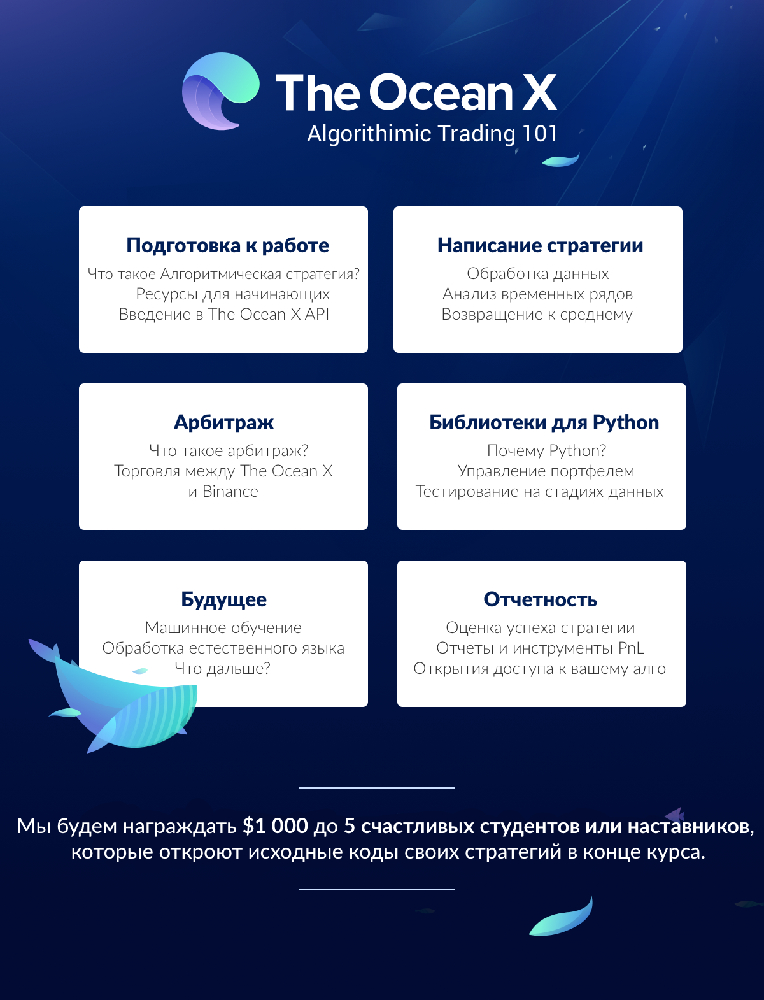

От арбитража до технического анализа, алгоритмические стратегии играют немаловажную роль на любом нефтяном рынке. Лучшая ликвидность, экономия затрат и скорость — это лишь некоторые из многих преимуществ, которые могут предложить боты. Для того чтобы помочь другим воспользоваться этими преимуществами, The Ocean X будет проводить курс *Алгоритмического трейдинга*, начиная со следующей недели! Мы начнем с нуля и научим любого с некоторыми начальными знаниями, как построить крипто-торговый бота.

В течение **6 недель** мы дадим вам фундаментальные знания, фрагменты кода и инструменты мониторинга, чтобы вам бот мог освоиться в "джунглях". И хотя мы не несем ответственности за конечную эффективность вашей стратегии, мы будем прилагать максимальное количество усилий в помощи на этом пути.

> Часть этой поддержки включает $1 000 (в криптовалюте) 5-ым лучшим студентам или каким-либо сообществом, которое делится своими обучающими материалами и показывают исходных код своих алгоритмов в конце данного пути.

## Что требуется для участия?
1. Зарегистрируйтесь, для того чтобы [получить API-ключ](https://beta.theoceanx.com/) для экспериментов
2. Вступайте в [наш Telegram-канал](https://t.me/joinchat/HgDxLhDPfm73w8ttRYv1Gw), чтобы быть вкурсе все последних новостей, важных объявлений курса, особенно информация о том, как открывать для всех ваш код в конце финальной недели
3. Подписывайтесь на [наш Twitter](https://twitter.com/theoceanxcrypto)

## 6-ти недельный учебный план

Могут быть изменены на основе ваших отзывов.

## Эксперимент нашего сообщества

Это лишь экспериментальное начало запуска и поддержки нашей сети Mainnet, где вы сможете раскрыть свои собственные стратегии на крипто-рынках в реальном времени. Наиболее успешные участники получат дополнительные призы.

Оставайтесь с нами, для того, чтобы узнать, как вы можете принять участие и подготовиться к нашему курсу в ближайшие недели. **Каждая стратегия имеет право на победу**, поэтому мы приветствуем как новичков, так и крипто-энтузиасто. Мы с нетерпением ждем, когда начнем учиться вчесте с вами!

---

## Содержание
0. ~~Введение в Алгоритмический трейдинг | План обучения~~
1. [Алгоритмический трейдинг — Урок 1 | Анализ временных рядов](/posts/algorithmic-trading-101-lesson-1-time-series-analysis/)
2. [Алгоритмический трейдинг — Урок 2 | Данные, Разработка стратегий и возвращение к среднему](/posts/algorithmic-trading-101-lesson-2-data-strategy-design-and-mean-reversion/)
3. [Алгоритмический трейдинг — Урок 3 | Введение в арбитражные стратегии](/posts/algorithmic-trading-101-lesson-3-introduction-to-arbitrage-strategies/)

---

Не забудьте присоединиться к [Telegram каналу The Ocean X](https://t.me/joinchat/HgDxLhDPfm73w8ttRYv1Gw), для того чтобы оставаться в курсе последний событий данного обучения.

Заодно можно подписаться на [мой Twitter](https://twitter.com/istom1n).