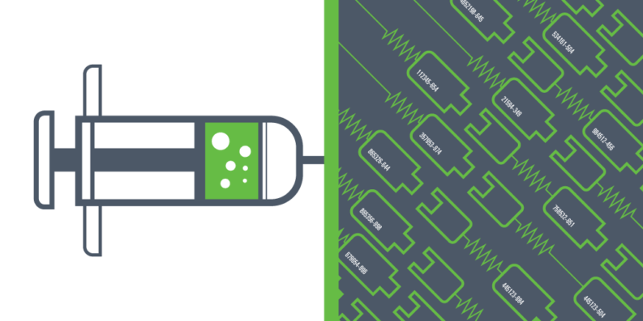

Вы едете в машине бизнес-класса, ваша работа заключается в том, чтобы делать автомобили за заказ. Объектно-ориентированный программист говорит вам: "нет проблем, я сделаю чертеж, который я могу использовать, чтобы сделать столько автомобилей, сколько я хочу!"...

```php
class Car
{
    public function drive()
    {
        // ...
    }
}
```

Для того чтобы картая машина работала, она должна облажать как минимум двигателем и колесами. Итак, существует несколько подходов к достижению этой цели. Например, можно выполнить следующиee:

```php
class Car
{
    public function __construct()
    {
        $this->engine = new Engine();

        $this->wheels = [
            new Wheel(), new Wheel(), 
            new Wheel(), new Wheel(),
        ];
    }

    public function drive() { ... }
}
```

Есть план для каждой машины, которую вы сделаете! Далее, ваш босс приходит к вам и говорит, что есть новый клиент и он хочет электрическую машину.

Так что в конечном итоге вы делаете это.

```php
class ElectricalCar extends Car
{
    public function __construct()
    {
        parent::__construct();

        $this->engine = new ElectricalEngine();
    }
}
```
"Отличное решение" — думаете вы. Конечно, есть избыточный нормальный двигатель, который создается при вызове `parent::__construct()`, но, по крайней мере, вы могли бы повторно использовать колеса!

Я думаю, вы понимаете к чему этовсе приведет. Следующий клиент захочет машину с необычными чехломи на руль, другой бы дидизельный двигатель с теми же колпаками, еще один просит гоночной автомобиль, и последний хочет самоуправляемую машину.

О, так был же клиент, который хотел купить двигатель, чтобы построить лодку с самим собой, но Вы сказали своему боссу, что это невозможно.

Через некоторое время в Вашем офисе оказывается тонна чертежей, каждый из которых описывает очень специфический вариант автомобиля. Вы начали с аккуратно упорядоченной кучи чертежей, но через некоторое время вы должны были сгруппировать их в разные папки и коробки, потому что это заняло слишком много времени, чтобы найти план, который вы ищете.

Объектно-ориентированные программисты часто попадают в эту ловушку наследования, заканчивающуюся полностью испорченной кодовой базой. Итак, давайте рассмотрим лучший подход. Может быть, вы слышали о" композиции над наследством" раньше?

> Композиция над наследованием является принципом, что классы должны достичь полиморфного поведения и повторного использования кода по их составу, а не наследование от базового или родительского класса
— [Wikipedia](https://en.wikipedia.org/wiki/Composition_over_inheritance)

Здесь слишком много модных словечек. Давайте просто посмотрим на наш пример автомобиля. Этот принцип гласит, что `Car` должен обеспечивать свое полиморфное поведение, будучи состоящим из других классов.

Слово *polymorphic* буквально означает "много форм" и подразумевает, что автомобиль должен иметь возможность управлять многими различными способами, в зависимости от контекста, в котором он используется.

При повторном использовании кода мы пытаемся сделать код многократно используемым, чтобы в конечном итоге десятки классов не делали почти то же самое.

## Какое это имеет отношение к инъекции зависимости?

Вместо того, чтобы сделать уникальный план, который описывает все возможные варианты автомобиля, мы предпочли бы, чтобы `Car` сделал одну вещь и сделал это хорошо: ездил.

Это означает, что это не должно быть заботой автомобиля о том, как построен его двигатель, какие колеса на нем прикреплены. Он должен знать только следующую вещь:

> Учитывая работающий двигатель и четыре колеса, я могу управлять.

Можно сказать, что для того, чтобы `Car` работал, ему нужны двигатель и колеса. Другими словами: `Car` зависит от `Engine` и `Wheels`.

Эти зависимости должны быть *переданы* `Car`. Или, сказал иначе: инъектированы.

```php
class Car
{
    public function __construct(
        Engine $engine, 
        array $wheels
    ) {
        $this->engine = $engine;
        $this->wheels = $wheels;
    }

    public function drive()
    {
        $this->engine->connectTo($this->wheels);

        $this->engine->start();

        $this->engine()->accelerate();
    }
}
```

Хотите гоночный автомобиль? Нет проблем!

```php
$raceCar = new Car(new TurboEngine(), [
    new RacingWheel(), new RacingWheel(),
    new RacingWheel(), new RacingWheel(),
]);
```

Тот клиент, которому нужны были специальные крышки для колес? У тебя все под контролем!

```php
$smugCar = new Car(new Engine(), [
    new FancyWheel(), new FancyWheel(),
    new FancyWheel(), new FancyWheel(),
]);
```

Теперь у вас *гораздо больше* гибкости!

**Dependency injection** — это идея дать классу свои требования извне, вместо того, чтобы этот класс отвечал за них сам.

## Чего внедрение зависимостей не может
Существуют фреймворки и инструменты, построенные на этом простом принципе и переводящие его на новый уровень. Возможно, вы слышали о них, давайте посмотрим на них ниже.

#### Общие зависимости
Одним из наиболее полезных побочных эффектов инъекционных зависимостей является то, что внешний контекст может контролировать их. Это означает, что вы можете предоставить один и тот же экземпляр класса нескольким другим, которые имеют зависимость от этого класса.

Зависимые или повторные зависимости, используемые чаще всего, получают метку «dependecy injection». Безусловно, очень хорошая практика, но разделение зависимости в сущности не является основным значением инъекции зависимости.

#### Контейнер зависимостей
Иногда это также называют контейнером «инверсии контроля (inversion of control)», хотя это не точное имя.

Каким бы ни было точное имя, контейнер представляет собой набор определений классов. Это большая коробка, которая знает, как объекты в вашем приложении могут быть созданы с другими зависимостями. Хотя в таком контейнере определенно много вариантов использования, нет необходимости делать инъекции зависимостей.

#### Автоматическая проводка
Чтобы предоставить разработчикам еще большую гибкость, в некоторых контейнерах учитываются интеллектуальные, автоматически определяемые определения классов. Это означает, что вам не нужно вручную описывать, как должен строиться каждый класс. Эти контейнеры сканируют ваш код и определяют, какие зависимости необходимы, просматривая типы подсказок и блоки документов.

Здесь много волшебства, но автоматическая проводка может быть полезным инструментом для быстрой разработки приложений.

#### Расположение службы (Service location)
Вместо того, чтобы вводить зависимости в класс, есть некоторые инструменты и фреймворки, которые позволяют классу просить контейнер «дать ему экземпляр другого класса».

Сначала это может показаться полезным, потому что нашему классу больше не нужно знать, как построить определенную зависимость. Однако: разрешая классу запрашивать зависимости от собственной учетной записи, мы вернемся к квадрату.

Для того, чтобы местоположение службы работало, наш класс должен знать о системах снаружи. Он не сильно отличается от вызова нового в самом классе. Эта идея на самом деле противоположна тому, что пытается сделать инъекция зависимости. Это неправильное использование контейнера.

#### Инъектировать все подряд
Как это происходит в реальных проектах, вы заметите, что инъекция зависимостей не всегда является решением вашей проблемы.

Важно понимать, что существуют пределы использования любых преисуществ. Вы всегда должны понимать, когда не используете их слишком часто, так как действительные существуют случаи, когда упрощенный подход является лучшим решением.

## Подводя итоги
Основная идея внедрения зависимостей очень проста, она позволяет лучше поддерживать, тестировать и отделять код, который будет написан.

Поскольку это такая мощная модель, что вокруг нее появляется множество инструментов. Я считаю, что главное в начале понять основной принцип, прежде чем использовать инструменты, построенные на нем.

---

<a target="_blank" href="https://www.stitcher.io/blog/dependency-injection-for-beginners">Источник статьи</a>