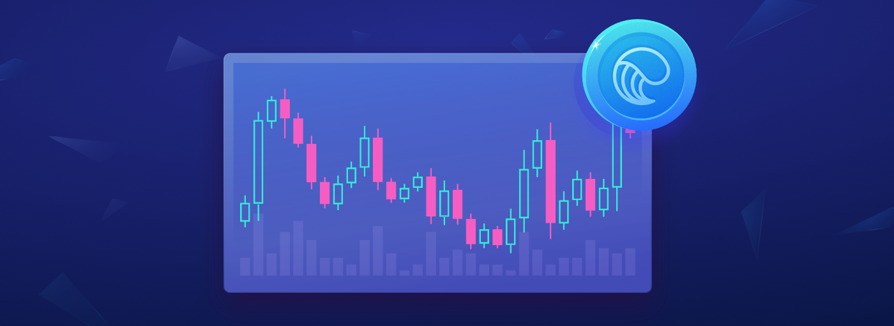

При построении алгоритмов с помощью моделей или регрессий — как мы делали в наших последних двух уроках, мы часто полагались на различные зависимые (объясняющие) переменные. Мы используем эти зависимые переменные для оценки тенденций в поведении цены. Затем мы научились создать предсказывающую модель будущей цены. Наконец, оценивая [статистическую значимость](https://hbr.org/2016/02/a-refresher-on-statistical-significance) нашего прогноза, мы делаем сделки на основе того, является ли цена завышенной или заниженной. Если мы предположим, что все делают это все время, и нет рынка разногласий, то мы получим то, что называется [гипотезами эффективного рынка](https://corporatefinanceinstitute.com/resources/knowledge/trading-investing/efficient-markets-hypothesis/), то, что инвесторы, постоянно обновляют свои модели с новейшей и самой лучшей информацей, и то, что цены на активы достигнут своего "равновесного" уровня, так как инвесторы быстро произвели свои покупили/продажи, основанные на новой информации, которая раскрывает, недооценены или переоценены ли активы. Следствием гипотезы эффективных рынков (которая сама по себе является [спорной](https://eml.berkeley.edu/~craine/EconH195/Fall_14/webpage/Malkiel_Efficient%20Mkts.pdf)) является то, что невозможно победить рынок в долгосрочной перспективе.

Однако, в краткосрочной перспективе цены действительно отклоняются от своего смоделированного равновесия, и из-за различных разногласий могут оставаться в данных уровнях довольно долго, чтобы вы — трейдеры могли использовать это. Также, это особенно актуально, в зарождающихся рынках криптовалют, где [каждый день](https://www.tokenspread.com), есть Интра-обмен и Интер-обмен арбитражных возможностей.

**Арбитраж** — это возможность одновременно покупать и продавать актив на основании расхождения цен. Если все сделано правильно, мы можем одновременно купить один и тот же актив по более низкой цене и продать по более высокой цене, тем самым зафиксировав "свободную прибыль". Но это легче сказать, чем сделать — эти арбитражные возможности могут существовать только в течение короткого периода времени, это довольно трудно (особенно в криптовалютном рынке), купить и продать одновременно, при этом учесть транзакционные издержки, которые могут съесть часть прибыли (это только три вопроса). Именно здесь происходит Алгоритмическая торговля — она может учитывать многие вопросы времени, риска и транзакционных издержек быстрее, чем обычный трейдер, и позволяет вам захватывать больше безрискового спреда *[Прим. И: Спред — разница между ценой покупки и ценой продажи в биржевом стакане]*.

## Виды арбитража

Арбитражные модели различаются по сложности, как и любые другие модели. Самый простой арбитраж — это **двойная модель**, в которой вы покупаете и продаете одновременно. Например, мы наблюдаем, что цена *ZRX* составляет $\$1,34$ на одной платформе и $\$1,36$ на другой платформе. Если вы разместите ордер покупку на $\$1.34$ и в то же время разместите ордер продажу того же количества на $\$1.36$, вы получите мгновенную прибыль в $\$0.02$, как только ордера будут выполнены. Конечно, этот простой пример предполагает, что каждый ордер размещается мгновенно. Поскольку задержка существует во всех системах ордеров, вам может потребоваться дополнительный *ZRX* в вашем кошельке, чтобы воспользоваться этой возможностью, так как ваш ордер на продажу может выполняться перед вашим ордером на покупку.

Более сложная модель называется **треугольной моделью**. Эта возможность арбитража может произойти внутри биржи на разных парах или на разных платформах, например, с разным количеством десятичных знаков (это особенно на традиционных валютных рынках).

Допустим, вы наблюдаете следующие цены на трех разных биржах:

- Биржа 1: USD/ZRX = 0.746 ZRX
- Биржа 2: ZRX/BTC = 0.000165 BTC
- Биржа 3: BTC/USD = $8 200.00

Предположим, у вас есть $\$100,000$, и вы конвертируете их в *ZRX* по курсу $\$0,746$, приобретая себе $74,600$ *ZRX*. Теперь путем преобразования $74,600$ *ZRX* в *BTC* по курсу $0.000165$, вы получаете $12.309$ *BTC*. И наконец, конвертируете ваш $12.309$ BTC обратно в *USD* по курсу $\$8 200$, которые дают вам $\$100,933.80$. Таким образом, эти три сделки "спина к спине" привели к безрисковой прибыли в размере $\$933.80$! Обратите внимание, что ваша общая прибыль зависит от размера вашего банковского "рулона" — вот почему, особенно на валютных рынках, например, многие сделки используют кредитное плечо для увеличения размера своей торговли. Даже когда спред небольшой, с кредитным плечом и непрерывной торговлей, можно генерировать везьма неплохие прибыли — но, как и во всем, убедитесь, что вы осознаете риски торговли.

## Моделирование арбитража

"Одновременный" арбитраж, подобный описанному выше, является наименее рискованной формой арбитража. Он реже проявляется и караткосрочен. Более распространенное "арбитражное моделирование" сосредоточено вокруг оценки степени отклонения цены актива от его "равновесной" цены.
Математически мы можем описать модель **арбитражной теории ценообразования** как:
$$
E[r_j]=r_f+b_1P_1+b_2P_2+\dots+b_nP_n
$$
где $E[r_j]$ — ожидаемый возврат от прибыли  
$r_f$ — безрисковая ставка  
$b_i$ — влияние цены продукта на покупателя  
$P_i$ — премия за риск  

Эта модель рассматривает доходность актива как линейную комбинацию регрессоров. Как только модель вычислит ожидаемую прибыль, мы сравним ее со справедливой рыночной ценой. Для случаев, если модель *АТЦ* определяет, что цена составляет $\$1.30$, а текущая рыночная цена составляет $\$1.20$, это будет означать, чтобы занять длинную позицию, как мы считаем, что рынок вернется к уровню $\$1.30$. Важно отметить, что модель *АТЦ* не гарантирует прибыль, как это делает одновременная торговля, но она обеспечивает возможности арбитража с высокой вероятностью, если модель правильно протестирована. Вы можете прочитать больше об этой модели [здесь](https://www.newyorkfed.org/medialibrary/media/research/staff_reports/sr216.pdf).

## Торговля парами

Всегда существует некоторая [корреляция](https://www.investopedia.com/terms/c/correlationcoefficient.asp) — степень, в которой цены движутся в одном направлении, между любыми двумя различными активами. Как правило, цены на два актива в одном секторе имеют высокую корреляцию. Например, если есть новое регулирование автомобилей, то, скорее всего, цены на акции как для *Tesla*, так и для *Ford* снижаются, что означает, что они сильно коррелируют. Вы видите подобное поведение, когда объявили криптовалютную новость — цены на многие активы криптовалют увеличить или уменьшить в унисон. Возможности арбитража существуют, когда корреляции расходятся с нормой. Предположим, что две криптовалюты прогрессируют с одной и той же скоростью, но после некоторого объявления новостей, цена (валюты А) уменьшается на 20%, но цена (валюты B) уменьшается только на 5%. Мы могли бы купить неэффективную монету (Валюта A) и продать сверхэффективную монету (Валюта B), исходя из предположения, что при равновесии цена обеих монет будет устанавливаться вокруг снижения на 10% в день *\[Прим. И: есть [хорошая таблица корреляции криптовалют](https://www.sifrdata.com/cryptocurrency-correlation-matrix/)\]*.

Эта методология торговли называется **парной торговлей**. Это похоже на модель (одного актива) средней скользящей, которую мы [обсуждали в прошлый раз](https://istomin.io/posts/algorithmic-trading-101-lesson-2-data-strategy-design-and-mean-reversion/). В торговле парами мы предполагаем, что два актива вернутся к своим уровням равновесной корреляции, в отличие от уровня цен (как в модели возвращения к среднему). Но, занимая две противоположные позиции,продажа одного актива и покупка другого — нам не нужно беспокоиться о том, что оба движутся в одном направлении, как увеличивая, так и уменьшая цену. Вместо этого мы заботимся только о взаимосвязи между ними, которая (часто, но не всегда) является статистически более значимой, чем любой индивидуальный прогноз уровня цен. И поскольку мы занимаем две позиции вместо одной, если пары цен сходятся, как и исторически, то, возможно, удастся получить двойную прибыль по сравнению со возвращением к среднему.

Риск в этой модели заключается в том, что пара расходится, а не сходится, как только вы берете свои позиции, это может привести к тому, что двух зайцев вы не убъете, скорее останетесь голодным. Эта модель также требует нескольких начальных параметров: вы должны выбрать интересующие вас активы, определить их текущую корреляцию, установить уровень входа, когда у вас есть корреляция "break", и управлять уровнем тейк-профита и стоп-лосса для обеих позиций, которые вы взяли. Конвергенция и дивергенция часто определяются доверительными интервалами, которые могут быть созданы с использованием стандартных отклонений, линий Боллинджера и торговыми диапазонами, среди других.

Вот некоторые ссылки, которые могут оказаться полезными для построения стратегии парного трейдинга:

- [Руководство для начинающих по торговле парами](https://traderhq.com/trading-strategies/beginners-guide-to-pairs-trading/) (Trader HQ)
- [Торговля парами на Python](https://www.quantopian.com/posts/how-to-build-a-pairs-trading-strategy-on-quantopian) (Quantopian)
- [Корреляционный Анализ Криптовалют](https://blog.patricktriest.com/analyzing-cryptocurrencies-python/) (Patrick Triest)
- [Расширенные тесты для выбора пары](https://www.maths.ox.ac.uk/system/files/attachments/593233.pdf) (Patrick McSharry)

## Торговле между централизованной и децентрализованной криптобиржами

Арбитраж между биржами требует точности для заказов, чтобы обеспечить максимальный спред мы можем получить за счет минимизации времени и стоимости выполнения сделки. Мы построили Ocean X с видением таких стратегий. Наша ликвидность, низкие комиссии, низкое время ожидания, система рыночных ордеров и исполнение без поручительства сделают торговлю быстрее, безопаснее и дешевле для вас, что делает арбитражные стратегии особенно прибыльными. Скоро мы объявим наших партнеров по ликвидности, структуру комиссий и главные преимущества.

## Задание №3

Тем временем, мы хотим дать вам инструменты для создания простого "Арбитражного бота" для торговли между нами и другими платформами. Чтобы построить такого бота, нам нужно:
- Получить API-интерфейсы для The Ocean X и другой биржи, например Binance
- Для The Ocean X смотрите наше [руководство по началу работы](https://medium.com/the-ocean-x/getting-started-with-the-ocean-x-api-for-node-js-f44c5a485865) и [документацию по API](https://docs.theoceanx.com/)
- Для Binance используйте [официальный API](https://github.com/binance-exchange/binance-official-api-docs/blob/master/rest-api.md) или [оболочку для JavaScript](https://github.com/binance-exchange/binance-api-node)
- Создайте цикл для проверки несоответствий цен
- Выполните ордер на покупку на "более дешевой" бирже и ордер на продажу на "переоцененной бирже" того же количества

Арбитражные возможности часто существуют только в течение очень коротких периодов времени. Если вы видите возможность, скорее всего, другие тоже ее видят тоже, и поэтому рынок, как правило, самокорректируется. Время исполнения рыночных ордеров становится критически важным для того, чтобы цены, которые вы видите, были ценами, которые вы получаете, поскольку Вы не хотите случайно минимизировать потери. Если рынок не ликвиден, он не может поддерживать крупные ордера, которые позволяют максимизировать прибыль. И если вам приходится ждать минуты, даже часы, на централизованных платформах, чтобы ваши сделки урегулировались, вы подвергаете себя риску и головным болям в управлении вашими токенами. Ocean X предоставляет множество преимуществ трейдерам, которые хотят воспользоваться возможностями арбитража, поэтому мы здесь, чтобы помочь вам начать! Попробуйте задание ниже, и если вы застряли, спросите нас в [Telegram](https://t.me/joinchat/HgDxLhDPfm73w8ttRYv1Gw) или отправьте нам письмо по адресу [hello@theoceanx.com](hello@theoceanx.com).

**- Задача:** создать арбитражную модель The Ocean X и Binance  
**- Бонус:** используя финансовые данные, создайте корреляционную матрицу между парами токенов, чтобы найти "равновесные" уровни  

> Помните, что любой, кто участвует в Telegram или отправляет нам решение в любое время в ходе нашей серии статей Алгоритмической торговли 101, имеет право получить **один из наших пяти нажих призов в виде $\$1000$ (в криптовалютном эквавиленте)**

---

## Содержание
0. [Введение в Алгоритмический трейдинг | План обучения](/posts/algorithmic-trading-101-the-syllabus/)
1. [Алгоритмический трейдинг — Урок 1 | Анализ временных рядов](/posts/algorithmic-trading-101-lesson-1-time-series-analysis/)
2. [Алгоритмический трейдинг — Урок 2 | Данные, Разработка стратегий и возвращение к среднему](/posts/algorithmic-trading-101-lesson-2-data-strategy-design-and-mean-reversion/)
3. ~~Алгоритмический трейдинг — Урок 3 | Введение в арбитражные стратегии~~

---

[Источник статьи](https://medium.com/the-ocean-x/algorithmic-trading-101-lesson-3-introduction-to-arbitrage-strategies-76e546b99691)
